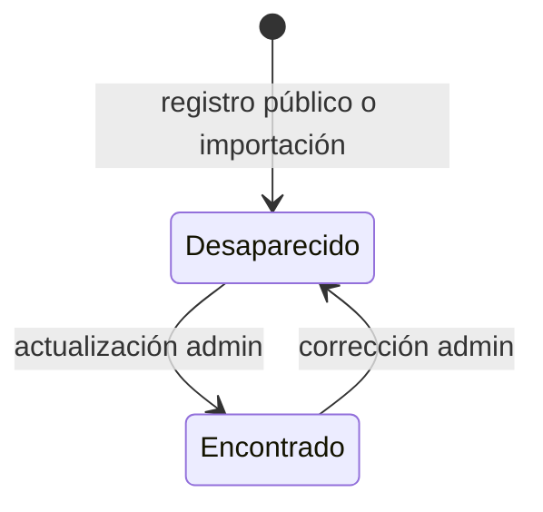
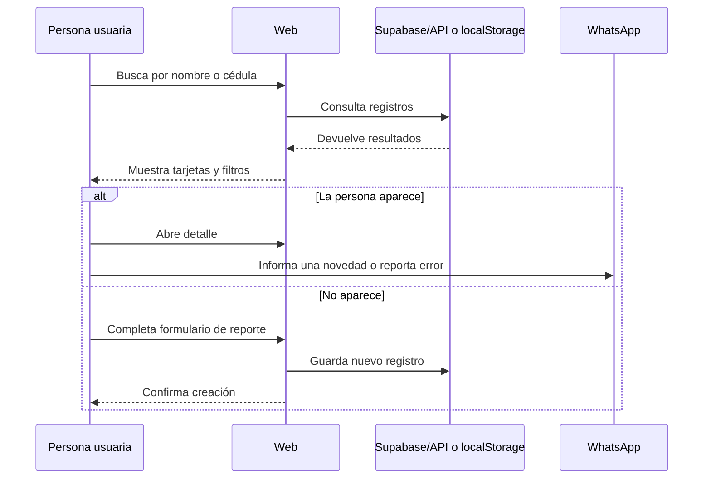
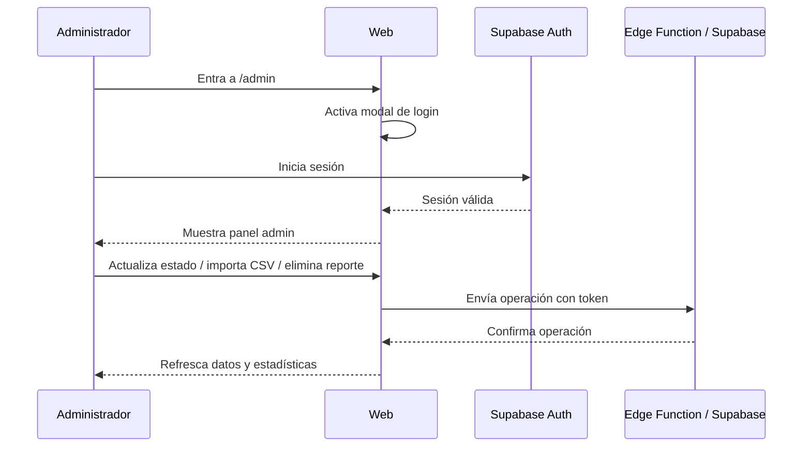

# Aquí Estoy Venezuela Web.

Plataforma web ciudadana para ayudar a registrar, buscar y actualizar información sobre personas desaparecidas o localizadas en Venezuela durante situaciones de emergencia.

La aplicación está pensada para que cualquier persona pueda buscar o registrar un reporte desde el navegador, y para que un equipo administrador pueda mantener la información actualizada con Supabase.

## En una frase

**Aquí Estoy Venezuela Web es un directorio web de emergencia para reunir información de personas reportadas, facilitar su búsqueda y marcar casos como localizados cuando haya novedades verificadas.**

## Para quién es este README

| Si sos... | Este README te ayuda a... |
|---|---|
| Persona no técnica | Entender qué hace el sitio, qué datos maneja y cómo se usa. |
| Frontend developer | Ubicar HTML, CSS, JavaScript, estado de UI, formularios, filtros y modo sandbox. |
| Backend/Supabase developer | Entender tabla `personas`, políticas RLS, Edge Function, Auth, Storage y endpoints. |
| DevOps/infra | Entender Docker, Nginx, dominio, SSL y proxy de API. |
| Mantenedor del proyecto | Tener un mapa claro para operar, revisar y extender el sistema. |

## Qué problema resuelve

En una emergencia, la información de personas desaparecidas o localizadas suele quedar dispersa en chats, redes sociales, formularios, llamadas y hojas de cálculo. Este proyecto centraliza esa información en una web simple:

1. Una persona busca por nombre o cédula.
2. Si encuentra un reporte, puede ver detalles y compartirlo.
3. Si no encuentra a la persona, puede registrar un nuevo reporte.
4. Un administrador puede actualizar el estado cuando la persona sea localizada.
5. La comunidad puede ayudar difundiendo o enviando información por WhatsApp.

## Qué hace la aplicación

### Funciones públicas

- Buscar personas por nombre, apellido o cédula.
- Ver estadísticas generales: reportados, desaparecidos y localizados.
- Filtrar resultados por estado, edad, tipo de lugar y ubicación.
- Ver una ficha detallada de cada persona.
- Registrar públicamente una persona desaparecida.
- Evitar duplicados básicos por cédula antes de registrar.
- Compartir reportes en redes sociales.
- Enviar información por WhatsApp sobre una persona desaparecida.
- Reportar errores de información por WhatsApp.

### Funciones administrativas

- Entrar por `/admin` para activar el login administrativo.
- Iniciar sesión con Supabase Auth.
- Ver acciones administrativas dentro de la interfaz principal.
- Actualizar estado: `Desaparecido` o `Encontrado`.
- Registrar ubicación donde fue encontrada la persona.
- Registrar quién reportó la localización.
- Eliminar reportes incorrectos.
- Importar registros por CSV.

## Cómo está construido

El proyecto tiene una arquitectura simple: una web estática con JavaScript en el navegador, Supabase como backend principal y una Edge Function como API intermedia opcional.

```mermaid
flowchart TD
    U[Usuario público] --> WEB[index.html + app.js]
    A[Administrador] --> ADMIN[/admin]
    ADMIN --> WEB

    WEB --> CONFIG[static/js/config.js]

    WEB -->|si no hay config real| LS[localStorage sandbox]
    WEB -->|si hay Supabase| API[Supabase Edge Function /functions/v1/api]
    WEB -->|fallback si API falla| SB[Supabase JS Client]

    API --> DB[(Tabla personas)]
    SB --> DB
    SB --> AUTH[Supabase Auth]
    SB --> STORAGE[Storage fotos-personas]

    WEB --> WA[WhatsApp]
    WEB --> SOCIAL[Redes sociales]
```

## Stack técnico

| Capa | Tecnología | Rol |
|---|---|---|
| UI | HTML + CSS + JavaScript vanilla | Interfaz pública y administrativa. |
| Estado frontend | Objeto global `state` en `app.js` | Controla filtros, sesión admin, paginación y modo sandbox. |
| Base de datos | Supabase/Postgres | Guarda reportes de personas. |
| Auth | Supabase Auth | Login de administradores. |
| API | Supabase Edge Function con Deno | Endpoints REST para estadísticas, búsqueda, creación, actualización, eliminación e importación. |
| Storage | Supabase Storage | Bucket público `fotos-personas` preparado por `schema.sql`. |
| CSV | PapaParse CDN | Lectura de archivos CSV desde el navegador. |
| Deploy | Docker + Nginx | Servir frontend estático y configurar dominio/SSL/proxy. |

## Estructura del repositorio

```text
.
├── index.html
├── admin/
│   └── index.html
├── static/
│   ├── css/
│   │   └── style.css
│   ├── img/
│   │   ├── fondo.png
│   │   └── logo.png
│   └── js/
│       ├── app.js
│       └── config.example.js
├── supabase/
│   └── functions/
│       └── api/
│           └── index.ts
├── schema.sql
├── Dockerfile
├── docker-compose.yml
├── nginx.conf
├── .gitignore
└── README.md
```

### Qué hace cada archivo importante

| Archivo | Descripción |
|---|---|
| `index.html` | Página principal. Define header, búsqueda, filtros, cards, modales de registro/login/detalle/estado y carga CSV. |
| `admin/index.html` | Página mínima que guarda `triggerAdminLogin` en `sessionStorage` y redirige a `/` para mostrar el login admin. |
| `static/css/style.css` | Estilos visuales, responsive, tarjetas, modales, botones, estados y panel admin. |
| `static/js/app.js` | Lógica principal: inicialización, Supabase/sandbox, búsqueda, filtros, render, formularios, admin, CSV, WhatsApp y compartir. |
| `static/js/config.example.js` | Plantilla para crear `static/js/config.js` con Supabase URL, anon key y número WhatsApp. |
| `schema.sql` | Crea tabla `personas`, políticas RLS, bucket `fotos-personas` y datos demo opcionales. |
| `supabase/functions/api/index.ts` | Edge Function que expone endpoints REST para operar con `personas`. |
| `Dockerfile` | Imagen Nginx Alpine para servir la web. |
| `docker-compose.yml` | Servicio Docker `apoyo-terremoto` en puerto 80. |
| `nginx.conf` | Configuración para dominio, SSL, headers de seguridad y proxy `/api/`. |

## Ruta rápida para probar localmente

### Opción A: abrir como sitio estático

1. Cloná el repositorio:

   ```bash
   git clone https://github.com/aquiestoyvenezuela/aquiestoyvenezuela-web.git
   cd aquiestoyvenezuela-web
   ```

2. Abrí `index.html` en tu navegador.

3. Si no configuraste Supabase, la app entra automáticamente en modo demo local.

### Opción B: configurar Supabase localmente

1. Copiá la plantilla de configuración:

   ```bash
   cp static/js/config.example.js static/js/config.js
   ```

2. Editá `static/js/config.js`:

   ```js
   const SUPABASE_URL = "https://your-project.supabase.co";
   const SUPABASE_ANON_KEY = "your-supabase-anon-key";
   const WHATSAPP_PHONE = "584120000000";
   ```

3. Abrí `index.html` en el navegador o servilo con cualquier servidor estático.

> `static/js/config.js` está ignorado por Git porque puede contener llaves reales del proyecto.

## Modo demo local

Cuando la app no encuentra una configuración real de Supabase, activa modo sandbox.

Este modo sirve para probar sin backend:

- guarda datos en `localStorage` del navegador;
- crea datos ficticios de ejemplo;
- permite búsqueda, filtros y paginación local;
- permite registrar reportes locales;
- permite probar actualización de estado;
- permite probar importación CSV;
- no envía datos a ningún servidor.

Credenciales demo de administrador:

```text
Email: admin@example.com
Password: change-me
```

> Importante: el modo demo no es producción. Si cambiás de navegador, dispositivo o limpiás `localStorage`, perdés esos datos locales.

## Configuración de Supabase

Para usar datos reales necesitás un proyecto Supabase.

### 1. Crear base de datos

1. Entrá a Supabase.
2. Creá o abrí un proyecto.
3. Abrí **SQL Editor**.
4. Ejecutá el contenido de `schema.sql`.

Ese script crea:

- tabla `public.personas`;
- políticas RLS para lectura pública, inserción pública y administración autenticada;
- bucket público `fotos-personas`;
- políticas de storage;
- registros demo opcionales.

### 2. Crear usuario administrador

En Supabase Auth, creá al menos un usuario administrador. La app considera administrador a cualquier usuario autenticado que pueda iniciar sesión.

Actualmente no hay una tabla de roles propia dentro del repo. El control se apoya en Supabase Auth y en políticas RLS para usuarios autenticados.

### 3. Configurar frontend

Creá `static/js/config.js` con:

```js
const SUPABASE_URL = "https://your-project.supabase.co";
const SUPABASE_ANON_KEY = "your-supabase-anon-key";
const WHATSAPP_PHONE = "584120000000";
```

### 4. Desplegar Edge Function, si aplica

La app intenta usar la Edge Function para varias operaciones. Si falla, usa fallback directo con Supabase JS Client.

Archivo de función:

```text
supabase/functions/api/index.ts
```

La función necesita variables de entorno de Supabase disponibles en el runtime:

```text
SUPABASE_URL
SUPABASE_ANON_KEY
```

## Modelo de datos

La tabla principal es `public.personas`.

| Campo | Tipo aproximado | Requerido | Descripción |
|---|---:|---:|---|
| `id` | bigint identity | Sí | Identificador interno autogenerado. |
| `nombre` | text | Sí | Nombre completo. |
| `cedula` | text unique | Sí | Cédula única, por ejemplo `V-12345678`. |
| `edad` | integer | No | Edad en años. |
| `ultima_ubicacion` | text | No | Último lugar conocido. |
| `telefono_contacto` | text | No | Teléfono de quien registra o puede aportar datos. |
| `observaciones` | text | No | Vestimenta, señas particulares, condiciones médicas u otros detalles. |
| `estado` | text | Sí | `Desaparecido` o `Encontrado`. |
| `ubicacion_encontrado` | text | No | Lugar donde fue localizada la persona. |
| `encontrado_por` | text | No | Nombre de quien reportó que fue encontrada. |
| `encontrado_por_cedula` | text | No | Cédula de quien reportó la localización. |
| `es_menor` | boolean | Sí | Indica si es menor de edad. |
| `foto_url` | text | No | URL de foto si existe. |
| `fecha_registro` | timestamptz | Sí | Fecha de creación del reporte. |
| `fecha_actualizacion` | timestamptz | Sí | Fecha de última actualización. |

### Estados de una persona



## API

La Edge Function implementa rutas bajo `/api` internamente. Desde el frontend se consume como:

```text
${SUPABASE_URL}/functions/v1/api/...
```

### Endpoints

| Método | Ruta | Acceso | Qué hace |
|---|---|---|---|
| `GET` | `/stats` | Público | Devuelve conteos totales. |
| `GET` | `/personas` | Público | Lista personas con búsqueda, filtros, orden y paginación. |
| `POST` | `/personas` | Público | Crea un reporte con estado inicial `Desaparecido`. |
| `PUT` | `/personas/:id/status` | Admin autenticado | Actualiza estado y datos de localización. |
| `DELETE` | `/personas/:id` | Admin autenticado | Elimina un reporte. |
| `POST` | `/import-csv` | Admin autenticado | Importa/upsertea registros por cédula. |

### Parámetros de `GET /personas`

| Parámetro | Ejemplo | Descripción |
|---|---|---|
| `q` | `maria` | Texto buscado. |
| `category` | `all` | `all`, `cedula`, `nombre`, `apellido`. |
| `status` | `Desaparecido` | `all`, `Desaparecido`, `Encontrado`. |
| `edad` | `adult` | `all`, `child`, `teen`, `adult`, `senior`. |
| `orden` | `recientes` | `recientes`, `nombre_asc`, `edad_asc`, `edad_desc`. |
| `tipoUbicacion` | `hospital` | `all`, `hospital`, `refugio`. |
| `ubicacion` | `Caracas` | Texto libre para ubicación. |
| `offset` | `0` | Inicio de paginación. |
| `limit` | `50` | Cantidad de registros. |

### Ejemplo de creación de reporte

```json
{
  "nombre": "Persona Ejemplo",
  "cedula": "V-12345678",
  "edad": 35,
  "ultima_ubicacion": "Ubicación conocida",
  "telefono_contacto": "0412-0000000",
  "observaciones": "Descripción relevante",
  "es_menor": false
}
```

## Flujo público de uso



## Flujo administrativo



## Frontend: cómo funciona

La mayor parte del frontend está en `static/js/app.js`.

### Estado global

`state` controla:

- si el usuario es admin;
- si se usa sandbox o Supabase;
- teléfono WhatsApp;
- registros actualmente mostrados;
- modo lista completa;
- filtros de búsqueda;
- paginación;
- estado de carga.

### Inicialización

Al cargar el DOM:

1. Revisa si existen `SUPABASE_URL` y `SUPABASE_ANON_KEY` reales.
2. Si existen, inicializa Supabase.
3. Si no existen o falla la inicialización, activa sandbox.
4. Carga estadísticas.
5. Registra listeners de UI.

### Render y UX

El frontend:

- renderiza tarjetas dinámicamente;
- usa modales para detalle, login, registro y actualización de estado;
- escapa HTML antes de inyectar datos en la UI;
- formatea cédulas con puntos para mejorar lectura;
- muestra toasts de éxito/error;
- pagina resultados con botón “Cargar más”.

## Backend/Supabase: cómo funciona

El backend real es Supabase. Hay dos caminos de comunicación:

1. **Camino preferido:** frontend → Edge Function → Supabase.
2. **Fallback:** frontend → Supabase JS Client directamente.

Esto permite que la web siga funcionando si la Edge Function no está disponible, aunque en producción conviene monitorear y mantener la función correctamente desplegada.

### Seguridad actual

`schema.sql` habilita RLS con estas reglas generales:

- lectura pública de personas;
- inserción pública de reportes;
- actualización solo para usuarios autenticados;
- eliminación solo para usuarios autenticados;
- lectura/subida pública de fotos en bucket `fotos-personas`;
- borrado de fotos solo para usuarios autenticados.

> Nota de mantenimiento: en una operación real con datos sensibles, conviene revisar si “cualquier usuario autenticado” es suficiente o si se necesita una tabla de roles administrativos.

## Importación CSV

La importación CSV está disponible para administradores.

La app usa PapaParse para leer el archivo en el navegador y mapea columnas de forma flexible.

### Columnas reconocidas

| Si el encabezado contiene... | Se interpreta como... |
|---|---|
| `nom`, `apell` | `nombre` |
| `ced`, `ci`, `doc`, `ident` | `cedula` |
| `edad`, `age`, `ano` | `edad` |
| `loc`, `ubi`, `dire` | `ultima_ubicacion` |
| `obs`, `det`, `sen` | `observaciones` |

### Reglas importantes

- Cada fila necesita al menos nombre y cédula.
- Si `edad < 18`, se marca `es_menor` automáticamente.
- En Supabase, la importación hace upsert por `cedula`.
- En sandbox, actualiza o inserta registros dentro de `localStorage`.

## Despliegue con Docker y Nginx

### Levantar con Docker Compose

```bash
docker compose up --build -d
```

Esto construye la imagen y expone el sitio en el puerto `80` del host.

### Qué hace el Dockerfile

- Usa `nginx:alpine`.
- Limpia el HTML default de Nginx.
- Copia `index.html`, `static/`, `schema.sql` y `nginx.conf`.
- Expone puertos `80` y `443`.

### Qué hace nginx.conf

- Redirige HTTP a HTTPS.
- Configura dominio `aquiestoyvenezuela.com` y `www.aquiestoyvenezuela.com`.
- Usa certificados Let's Encrypt esperados en:

  ```text
  /etc/letsencrypt/live/aquiestoyvenezuela.com/fullchain.pem
  /etc/letsencrypt/live/aquiestoyvenezuela.com/privkey.pem
  ```

- Agrega headers básicos de seguridad.
- Sirve archivos estáticos.
- Proxya `/api/` hacia `http://apivzla/`.

> Si vas a desplegar en otro dominio, tenés que ajustar `server_name`, certificados y posiblemente el proxy `/api/`.

## Seguridad y privacidad

Este proyecto puede manejar datos personales sensibles: nombres, cédulas, edades, ubicaciones, teléfonos y detalles de personas desaparecidas. Eso requiere cuidado operativo.

### No commitear

- `static/js/config.js` con llaves reales.
- `.env` o `.env.*`.
- Certificados privados.
- Backups de producción.
- Datos reales usados para pruebas.
- Listados CSV reales.

### Recomendaciones antes de producción

- Revisar políticas RLS con alguien responsable de seguridad/datos.
- Definir quién puede tener cuenta admin.
- Considerar roles explícitos para administradores.
- Auditar operaciones de eliminación.
- Evitar exponer datos innecesarios en la vista pública.
- Tener un proceso de corrección y eliminación de datos erróneos.
- Validar obligaciones legales de protección de datos personales.

## Checklist de puesta en producción

- [ ] Proyecto Supabase creado.
- [ ] `schema.sql` ejecutado.
- [ ] RLS revisado.
- [ ] Usuario administrador creado.
- [ ] `static/js/config.js` configurado con valores reales.
- [ ] `WHATSAPP_PHONE` apunta a un número atendido por el equipo.
- [ ] Edge Function desplegada si se va a usar API intermedia.
- [ ] Dominio configurado.
- [ ] Certificados SSL instalados.
- [ ] Nginx ajustado al dominio real.
- [ ] Prueba de búsqueda pública completada.
- [ ] Prueba de registro público completada.
- [ ] Prueba de login admin completada.
- [ ] Prueba de actualización a `Encontrado` completada.
- [ ] Prueba de eliminación completada, si esa función se habilita en operación.
- [ ] Prueba de importación CSV completada.
- [ ] Política de tratamiento de datos definida.

## Troubleshooting

| Problema | Causa probable | Qué revisar |
|---|---|---|
| La app muestra modo demo | No existe `static/js/config.js` o tiene placeholders. | Copiar `config.example.js` y completar valores reales. |
| No cargan estadísticas | Edge Function caída, URL/key incorrectas o error de RLS. | Consola del navegador, Supabase logs, endpoint `/stats`. |
| No aparecen resultados | Filtros demasiado restrictivos o tabla vacía. | Limpiar filtros, revisar tabla `personas`. |
| No guarda un reporte | Duplicado por cédula, error de red o política RLS. | Toast, consola, Supabase logs. |
| Login admin falla | Usuario inexistente, password incorrecto o Supabase mal configurado. | Supabase Auth y `config.js`. |
| No actualiza estado | No hay sesión admin o token inválido. | Login, headers `Authorization`, políticas RLS. |
| CSV no importa | Columnas no reconocidas o sesión admin ausente. | Encabezados CSV y login activo. |
| Docker levanta pero HTTPS falla | Certificados no existen en la ruta esperada. | `nginx.conf`, Let's Encrypt y volúmenes/montajes. |
| `/api/` no responde en Nginx | Upstream `apivzla` no existe o no está conectado. | Red Docker, nombre de servicio, proxy_pass. |

## Guía para contribuir

### Cambios de documentación

- Mantener lenguaje claro para personas técnicas y no técnicas.
- Explicar por qué existe cada parte, no solo cómo ejecutarla.
- No incluir datos reales ni credenciales.

### Cambios frontend

- Revisar `index.html`, `static/css/style.css` y `static/js/app.js` juntos.
- Probar modo sandbox antes de conectar Supabase.
- Cuidar accesibilidad de formularios, modales y botones.
- Escapar cualquier dato dinámico que se inyecte como HTML.

### Cambios backend/Supabase

- Actualizar `schema.sql` si cambia la tabla o las políticas.
- Documentar nuevas variables de entorno.
- Mantener sincronía entre Edge Function y fallback directo del frontend.
- Revisar RLS antes de relajar permisos.

### Cambios de infraestructura

- Revisar dominio, certificados y proxy antes de tocar `nginx.conf`.
- No asumir que el servicio upstream `/api/` existe si no está definido en Compose.
- Documentar cualquier cambio de puertos o dominios.

## Posibles mejoras futuras

- Separar `app.js` en módulos: API client, render, formularios, admin, CSV y utilidades.
- Agregar tests automáticos para utilidades de formato, filtros y mapeo CSV.
- Agregar roles administrativos explícitos.
- Agregar auditoría de cambios sobre reportes sensibles.
- Mejorar validaciones de cédula, teléfono y campos requeridos.
- Agregar una política clara de retención/eliminación de datos.
- Documentar despliegue de Supabase Edge Functions paso a paso.

## Resumen para mantenimiento rápido

- Si querés cambiar la UI: empezá por `index.html` y `static/css/style.css`.
- Si querés cambiar comportamiento: revisá `static/js/app.js`.
- Si querés cambiar datos/permisos: revisá `schema.sql`.
- Si querés cambiar API: revisá `supabase/functions/api/index.ts` y el fallback en `app.js`.
- Si querés cambiar deploy: revisá `Dockerfile`, `docker-compose.yml` y `nginx.conf`.
- Si la app entra en demo sin querer: revisá `static/js/config.js`.
