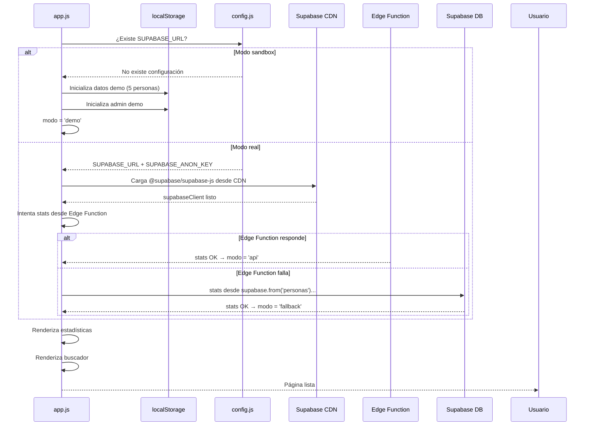
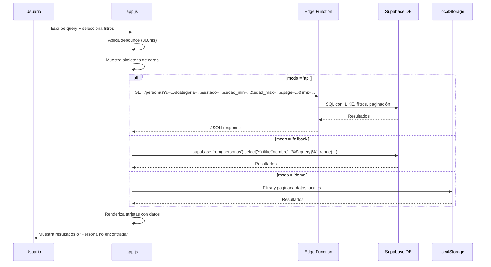
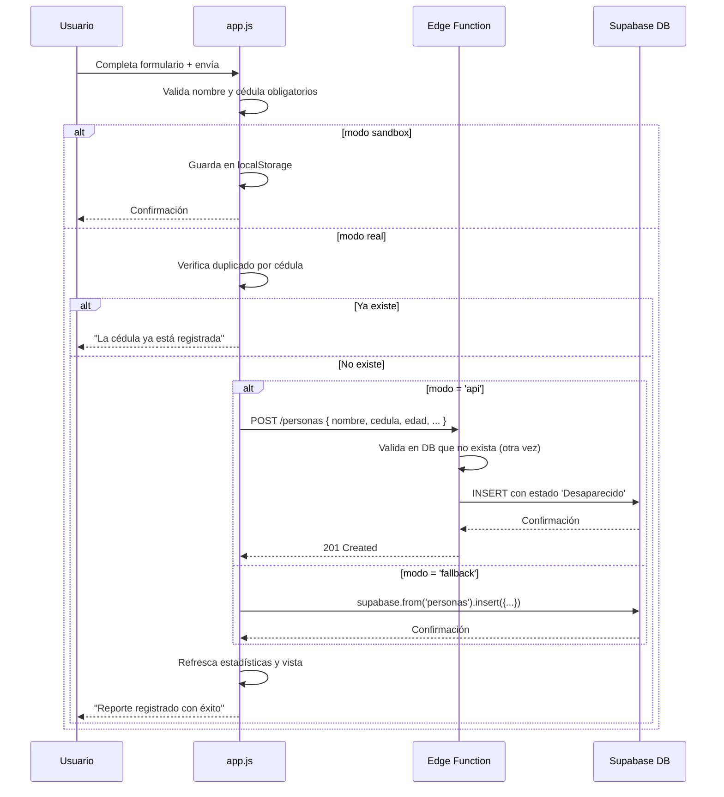
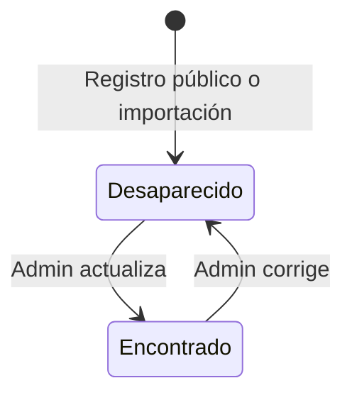

# Arquitectura del sistema — Aquí Estoy Venezuela

> Arquitectura, componentes, flujos técnicos y decisiones del sistema.

## Audiencia

Desarrollo, arquitectura, seguridad, DevOps y QA.

## Qué responde este documento

Cómo está construido el sistema, qué endpoints y datos existen, y qué brechas separan la arquitectura actual de la objetivo.

## Estado y fecha de revisión

- Fecha: 2026-06-29.
- Rama: `docs/audit-and-current-architecture`.
- Referencia local: `8d7dfcb442772099958efc8578db124a7b3a7bff`.
- Estado: revisión documental Codex; no confirma despliegue productivo ni sustituye validación humana.

> Documento técnico para desarrolladores que quieren entender, contribuir o extender el proyecto.

---

## Índice

- [Resumen de arquitectura](#resumen-de-arquitectura)
- [Patrón: SPA con conmutación por error (failover)](#patrón-spa-con-conmutación-por-error-failover)
- [Flujo de decisiones en runtime](#flujo-de-decisiones-en-runtime)
- [Componentes del sistema](#componentes-del-sistema)
  - [Frontend (app.js)](#frontend-appjs)
  - [Edge Function (API)](#edge-function-api)
  - [Base de datos (schema.sql)](#base-de-datos-schemasql)
  - [Configuración y despliegue](#configuración-y-despliegue)
- [Rutas y endpoints](#rutas-y-endpoints)
- [Modelo de datos](#modelo-de-datos)
- [Seguridad: RLS y autenticación](#seguridad-rls-y-autenticación)
- [Decisiones arquitectónicas registradas](#decisiones-arquitectónicas-registradas)
- [Dualidad de comunicación: Edge Function vs. Supabase JS](#dualidad-de-comunicación-edge-function-vs-supabase-js)
- [Modo sandbox (localStorage)](#modo-sandbox-localstorage)
- [Patrones de código en app.js](#patrones-de-código-en-appjs)
- [Riesgos arquitectónicos identificados](#riesgos-arquitectónicos-identificados)

---

## Resumen de arquitectura

Aquí Estoy Venezuela es una **SPA (Single Page Application)** en JavaScript vanilla que se comunica con Supabase como plataforma backend. Su característica arquitectónica más distintiva es un **sistema de failover de tres modos**:

```
Edge Function (preferido)
  └── Supabase JS Client directo (fallback si la API falla)
       └── localStorage sandbox (si no hay configuración real)
```

Esta dualidad permite que la aplicación funcione sin backend configurado (modo demo) y que sea resiliente si la Edge Function no responde.

---

## Patrón: SPA con conmutación por error (failover)

### Diagrama de decisión

```mermaid
flowchart TD
    INICIO[La aplicación inicia] --> CHECK_CONFIG{¿Existe config.js / con SUPABASE_URL?}

    CHECK_CONFIG -->|Sí, hay configuración| MODO_REAL[Modo real con Supabase]
    CHECK_CONFIG -->|No, sin configuración| MODO_DEMO[Modo sandbox localStorage]

    MODO_REAL --> INICIO_REAL[Carga supabaseClient / desde CDN]
    INICIO_REAL --> INTENTO_API{¿Llamar a Edge Function?}

    INTENTO_API -->|Éxito| USA_API[Usa datos de la API]
    INTENTO_API -->|Error o timeout| FALLBACK[Conmuta a Supabase JS directo]

    FALLBACK --> USA_DB[Usa supabase.from(personas)...]
    USA_API --> RENDER[Renderiza resultados]
    USA_DB --> RENDER

    MODO_DEMO --> USA_LS[Trabaja sobre localStorage]
    USA_LS --> RENDER

    style INTENTO_API fill:#f9f,stroke:#333
    style CHECK_CONFIG fill:#f9f,stroke:#333
```

### ¿Por qué este patrón?

| Razón | Explicación |
|-------|-------------|
| **Resiliencia** | Si la Edge Function está caída o no desplegada, la app sigue funcionando consultando Supabase directamente |
| **Desarrollo local** | Sin backend, el modo sandbox permite desarrollo y pruebas completas |
| **Simplicidad** | Sin dependencias de frameworks, sin bundlers, sin compilación |
| **Costo** | Sin backend que mantener para desarrollo/demo |

### Costo de la dualidad

| Aspecto | Implicación |
|---------|-------------|
| **Mantenimiento** | Cada cambio de lógica debe implementarse en dos lugares: Edge Function (TypeScript) y fallback (JavaScript) |
| **Comportamiento inconsistente** | Si la API y el fallback no coinciden, los usuarios pueden ver resultados diferentes |
| **Complejidad cognitiva** | app.js (1791 líneas) contiene toda la lógica de ambos caminos y del sandbox, lo que dificulta la legibilidad |
| **Autenticación** | El fallback directo expone el `supabaseClient` con `SUPABASE_ANON_KEY` al navegador (es el diseño normal de Supabase, pero vale la pena notarlo) |

---

## Flujo de decisiones en runtime

### Inicialización



### Búsqueda



### Creación de reporte



---

## Componentes del sistema

### Frontend (app.js)

**Archivo**: `static/js/app.js` — 1791 líneas, JavaScript vanilla sin frameworks.

**Responsabilidades**:
- Búsqueda con filtros (nombre, cédula, estado, edad, ubicación)
- Paginación infinita ("Cargar más")
- Registro de personas desaparecidas
- Detalle de persona (modal)
- Panel administrativo (login, cambio de estado, eliminación, importación CSV)
- Estadísticas en dashboard
- Modo sandbox completo con datos demo
- Soporte multiruta API/fallback/sandbox

**Patrones notables**:

| Patrón | Ubicación | Descripción |
|--------|-----------|-------------|
| Debounce en búsqueda | ~línea 1660 | setTimeout de 300ms en input de búsqueda, canceleable con clearTimeout |
| Detección de modo | ~línea 30-60 | try/catch al cargar config.js, intento de fetch a Edge Function |
| Render vía innerHTML | General | La UI se construye concatenando strings HTML y asignando a innerHTML |
| CSS-in-JS (string literal) | ~línea 100-140 | Estilos para skeletons inline en el JS |
| sessionStorage trigger | ~línea 1410 | Login por redirect usando sessionStorage como flag |
| PapaParse CSV | ~línea 1250 | Lectura de CSV en el navegador, mapeo de columnas por nombre |
| Debounced stats | ~línea 1720-1730 | Llamadas a stats con debounce para no saturar |

**Llamadas a Supabase/API**:

| Ruta | Método | Propósito | Autenticación |
|------|--------|-----------|:------------:|
| `/api/stats` | GET | Estadísticas generales | No |
| `/api/personas` | GET | Búsqueda de personas | No |
| `/api/personas` | POST | Crear nuevo reporte | No |
| `/api/personas/:id/status` | PUT | Actualizar estado | Sí (Bearer token) |
| `/api/personas/:id` | DELETE | Eliminar reporte | Sí (Bearer token) |
| `/api/import-csv` | POST | Importación masiva CSV | Sí (Bearer token) |

---

### Edge Function (API)

**Archivo**: `supabase/functions/api/index.ts` — Deno + Supabase JS.

**Tecnología**: Deno (TypeScript), runtime de Supabase Edge Functions.

**Endpoints**:

```typescript
// Rutas implementadas
GET    /api/stats                                       // Conteo total, desaparecidos, encontrados
GET    /api/personas?q=&categoria=&estado=&edad_min=&edad_max=&ubicacion=&page=&limit=
POST   /api/personas         body: { nombre, cedula, edad?, ... }
PUT    /api/personas/:id/status  body: { estado, ubicacion_encontrado?, ... }
DELETE /api/personas/:id
POST   /api/import-csv       body: { rows: [...] }
```

**Detalles de implementación**:

| Aspecto | Detalle |
|---------|---------|
| Framework | Sin framework — usa `serve()` de Deno con router manual por URL |
| Validación | Nombre y cédula requeridos en POST; verificación de duplicado por cédula |
| Paginación | `limit` + `offset` con valores por defecto (limit=20) |
| Búsqueda | `ILIKE` con wildcards en nombre, cédula y ubicación |
| Filtros | Estado, rango de edad (edad_min/edad_max), ubicación |
| Import CSV | Upsert con `onConflict: 'cedula'`, array de registros por request |
| Manejo de errores | try/catch que retorna `{ error: mensaje }` con status code |
| CORS | Headers permitidos: todos los orígenes, métodos GET/POST/PUT/DELETE/OPTIONS |
| Auth | Verifica token JWT de Supabase en endpoints protegidos |

**Variables de entorno requeridas**:
- `SUPABASE_URL` — URL del proyecto Supabase
- `SUPABASE_ANON_KEY` — Clave anónima (para inicializar el cliente)

---

### Base de datos (schema.sql)

**Archivo**: `schema.sql`.

**Tabla principal**: `public.personas`

```sql
-- Columnas
id                    bigint GENERATED ALWAYS AS IDENTITY PRIMARY KEY
nombre                text NOT NULL
cedula                text NOT NULL UNIQUE
edad                  integer
ultima_ubicacion      text
telefono_contacto     text
observaciones         text
estado                text NOT NULL DEFAULT 'Desaparecido' CHECK (estado IN ('Desaparecido', 'Encontrado'))
ubicacion_encontrado  text
encontrado_por        text
encontrado_por_cedula text
es_menor              boolean NOT NULL DEFAULT false
foto_url              text
fecha_registro        timestamptz NOT NULL DEFAULT now()
fecha_actualizacion   timestamptz NOT NULL DEFAULT now()
```

**Índices**:

| Índice | Tipo | Propósito |
|--------|------|-----------|
| `idx_personas_estado_fecha` | B-tree | Ordenar por estado + fecha |
| `idx_personas_edad` | B-tree | Filtrar por rango de edad |
| `idx_personas_nombre_btree` | B-tree | Búsqueda por prefijo de nombre |
| `idx_personas_nombre_trgm` | GIN (trigram) | Búsqueda por substring en nombre |
| `idx_personas_cedula_trgm` | GIN (trigram) | Búsqueda por substring en cédula |
| `idx_personas_ultima_ubicacion_trgm` | GIN (trigram) | Búsqueda por ubicación |
| `idx_personas_ubicacion_encontrado_trgm` | GIN (trigram) | Búsqueda por ubicación de encuentro |

**Seed data**: 4 personas ficticias insertadas al final del schema.

**Extensiones requeridas**: `pg_trgm`.

---

### Configuración y despliegue

#### Docker / Nginx

| Archivo | Propósito |
|---------|-----------|
| `Dockerfile` | Imagen basada en nginx:alpine, copia el frontend y configuración |
| `docker-compose.yml` | Define un servicio `web` con puertos 80:80 y 443:443 |
| `nginx.conf` | Servidor Nginx con dominio, SSL, proxy /api/, seguridad |

**Problema identificado en nginx.conf**:

```nginx
location /api/ {
    proxy_pass http://apivzla/;  # ← Este servicio NO existe en docker-compose.yml
}
```

El proxy `/api/` apunta a un servicio `apivzla` que no está definido. Esto probablemente significa que el proxy no es funcional y la comunicación con la Edge Function se hace directamente a la URL de Supabase.

#### Archivo de configuración del frontend

```js
// static/js/config.example.js
const SUPABASE_URL = "https://tu-proyecto.supabase.co";
const SUPABASE_ANON_KEY = "tu-clave-anon";
const WHATSAPP_PHONE = "584120000000";
```

Este archivo debe ser copiado a `static/js/config.js` (ignorado por Git). Si no existe, la aplicación entra en modo sandbox.

---

## Rutas y endpoints

### Resumen de todas las rutas

| Ruta | Propósito | Autenticación | Archivo |
|------|-----------|:-------------:|---------|
| `/` (index.html) | Página principal SPA | No | `index.html` |
| `/admin/` | Redirección para login admin | No | `admin/index.html` |
| `/api/stats` (GET) | Estadísticas | No | Edge Function |
| `/api/personas` (GET) | Búsqueda con filtros | No | Edge Function |
| `/api/personas` (POST) | Crear reporte | No | Edge Function |
| `/api/personas/:id/status` (PUT) | Actualizar estado | Sí (JWT) | Edge Function |
| `/api/personas/:id` (DELETE) | Eliminar reporte | Sí (JWT) | Edge Function |
| `/api/import-csv` (POST) | Importación CSV | Sí (JWT) | Edge Function |

### Flujo de admin/redirect

```
/admin/index.html
  → Guarda triggerAdminLogin en sessionStorage
  → Redirige a /
  → app.js detecta el trigger
  → Abre modal de login
  → Usuario ingresa credenciales
  → Supabase Auth signInWithPassword()
  → Activa panel admin
```

---

## Modelo de datos

### Estado



### Relaciones

Actualmente el modelo tiene una **sola tabla** (`personas`) sin relaciones. No hay tablas de:
- Auditoría de cambios
- Roles de administrador
- Usuarios del sistema (la autenticación la maneja Supabase externamente)
- Sesiones ni tokens (manejados por Supabase Auth)
- Categorías, ubicaciones normalizadas o tipos de lugar

---

## Seguridad: RLS y autenticación

### Políticas RLS actuales

```sql
-- Habilitar RLS en la tabla
ALTER TABLE public.personas ENABLE ROW LEVEL SECURITY;

-- SELECT: cualquier persona puede leer
CREATE POLICY "Lectura pública" ON public.personas
    FOR SELECT USING (true);

-- INSERT: cualquier persona puede insertar
CREATE POLICY "Inserción pública" ON public.personas
    FOR INSERT WITH CHECK (true);

-- UPDATE: solo usuarios autenticados
CREATE POLICY "Actualización solo autenticados" ON public.personas
    FOR UPDATE USING (auth.role() = 'authenticated');

-- DELETE: solo usuarios autenticados
CREATE POLICY "Eliminación solo autenticados" ON public.personas
    FOR DELETE USING (auth.role() = 'authenticated');
```

### Análisis de RLS

| Operación | ¿Quién puede? | Riesgo |
|-----------|:-------------:|:------:|
| SELECT (leer) | **Cualquier persona, incluso sin API key** | **P0** — datos personales expuestos |
| INSERT (crear) | **Cualquier persona** | **P1** — posible inserción masiva de datos falsos |
| UPDATE (modificar) | Solo autenticados | Bajo |
| DELETE (eliminar) | Solo autenticados | Bajo |

> **Nota**: La política de SELECT no distingue entre columnas públicas y privadas. Toda la fila es visible. No hay políticas a nivel de columna.

### Autenticación

- **Mecanismo**: Supabase Auth con email + contraseña
- **Clientes**: `supabaseClient.auth.signInWithPassword()`
- **Sesión**: JWT manejado por Supabase, alamacenado en cookies/localStorage del navegador
- **No hay roles**: cualquier usuario autenticado tiene permisos totales de UPDATE y DELETE
- **No hay gestión de usuarios**: no existe interfaz para crear/eliminar administradores

---

## Decisiones arquitectónicas

> [!NOTE]
> Estas decisiones fueron **inferidas** por el auditor a partir del código existente. No son ADRs formalmente aceptados por el equipo. Se registran aquí para documentar el estado actual y facilitar la discusión.

### ADR-001: SPA vanilla sin framework — Decisión inferida

**Contexto**: Necesidad de una aplicación web de emergencia que pueda ser desplegada sin build steps y mantenida por cualquier desarrollador.

**Decisión**: JavaScript vanilla, HTML5, CSS3 sin bundlers, sin transpilación, sin frameworks.

**Consecuencias**:
- + Sin dependencias de npm, sin node_modules, sin build
- + Carga instantánea (sin bundle que descargar)
- - Código monolítico de 1791 líneas en app.js
- - Sin tipado estático, sin tree-shaking
- - Mantenimiento más complejo a medida que crece

### ADR-002: Failover API → Supabase JS directo — Decisión inferida

**Contexto**: La Edge Function de Supabase puede no estar desplegada; se necesita un camino alternativo.

**Decisión**: La app intenta primero la Edge Function; si falla, usa el cliente de Supabase directo.

**Consecuencias**:
- + Resiliencia operativa
- + Desarrollo sin Edge Function desplegada
- - Lógica duplicada en dos lenguajes (TypeScript y JS)
- - Comportamiento puede diferir entre caminos

### ADR-003: localStorage como modo sandbox — Decisión inferida

**Contexto**: Desarrolladores y evaluadores necesitan probar la app sin backend.

**Decisión**: Si no hay config.js con datos de Supabase, todo funciona sobre localStorage.

**Consecuencias**:
- + Demo funcional sin backend
- + Ideal para onboarding y pruebas visuales
- - Tres caminos de ejecución que mantener
- - Funcionalidades administrativas simuladas (no reales)

### ADR-004: Cédula como clave única — Decisión inferida

**Contexto**: Necesidad de evitar duplicados en una emergencia donde la misma persona puede ser reportada múltiples veces.

**Decisión**: `cedula` tiene restricción UNIQUE. Antes de insertar se verifica duplicado.

**Consecuencias**:
- + Previene duplicados exactos
- + Permite upsert en importación CSV
- - Personas sin cédula (recién nacidos, extranjeros sin documento) no pueden ser registrados
- - Un error de tipeo en la cédula crea un duplicado no detectado

### ADR-005: Sin tabla de auditoría — Decisión inferida (no una recomendación)

**Contexto**: El proyecto es una versión inicial de emergencia.

**Decisión**: No hay tabla de historial de cambios. Los updates sobreescriben los datos anteriores.

**Consecuencias**:
- - No se puede rastrear quién cambió qué
- - No se puede revertir un cambio
- - No se puede auditar el uso del sistema

---

## Dualidad de comunicación: Edge Function vs. Supabase JS

### Comparación

| Aspecto | Edge Function | Supabase JS directo |
|---------|:-------------:|:-------------------:|
| **Tecnología** | Deno (TypeScript) | JavaScript (navegador) |
| **Ubicación** | Servidor Supabase | Navegador del usuario |
| **Latencia** | Media (requiere HTTP) | Baja (persistencia de conexión) |
| **Seguridad** | Token JWT validado en servidor | RLS del lado de Supabase |
| **Control** | Validación personalizada en servidor | Solo validación RLS |
| **Mantenimiento** | Requiere deploy separado | Sin deploy adicional |
| **Estado** | Código escrito, deploy no verificado | Funcional si hay config.js |

### ¿Cuándo se usa cada uno?

```javascript
// Pseudocódigo de la lógica de decisión en app.js
async function apiRequest(method, path, body = null) {
    try {
        const url = `${SUPABASE_URL}/functions/v1/api${path}`;
        const options = { method, headers: { 'Content-Type': 'application/json' } };
        if (body) options.body = JSON.stringify(body);
        if (session) options.headers.Authorization = `Bearer ${session.access_token}`;

        const res = await fetch(url, options);
        if (!res.ok) throw new Error(`API error: ${res.status}`);
        return await res.json();
    } catch (e) {
        // Fallback a Supabase JS directo
        return fallbackRequest(method, path, body);
    }
}
```

---

## Modo sandbox (localStorage)

### Inicialización

Cuando arranca la app sin `config.js`:
1. Carga datos demo: 5 personas ficticias en localStorage bajo clave `personas`
2. Crea un admin demo: `{ email: 'admin@admin.com', pass: 'admin' }`

### Operaciones en sandbox

| Operación | Implementación |
|-----------|----------------|
| Búsqueda | Filtra array en localStorage con `filter()` e `includes()` |
| Estadísticas | Cuenta elementos por estado desde localStorage |
| Crear reporte | `push()` al array + `localStorage.setItem()` |
| Actualizar estado | `find()` + modificar propiedad + `setItem()` |
| Eliminar | `filter()` excluyendo el ID + `setItem()` |
| Importar CSV | Mismo PapaParse, escribe a localStorage |

### Limitaciones del sandbox
- Los datos no persisten entre navegadores o dispositivos
- Al limpiar localStorage se pierden todos los datos
- El admin demo es ficticio (no hay validación real)
- El tamaño máximo de localStorage (~5-10 MB) limita la cantidad de registros

---

## Patrones de código en app.js

### Variables globales

```javascript
// Modo de operación
const MODO_API = 'api';
const MODO_FALLBACK = 'fallback';
const MODO_DEMO = 'demo';
let modo = MODO_DEMO;  // por defecto

// Clientes y estado
let supabaseClient = null;
let adminSession = null;
let currentFilters = {};
let currentPage = 0;
let isLoading = false;
```

### Patrón de debounce

```javascript
// ~línea 1660
let searchTimeout;
inputBusqueda.addEventListener('input', function() {
    clearTimeout(searchTimeout);
    searchTimeout = setTimeout(() => {
        realizarBusqueda(this.value);
    }, 300);
});
```

### Patrón de fetch con timeout para detección de API

```javascript
// ~línea 40-55
async function checkApiAvailable() {
    try {
        const controller = new AbortController();
        const timeoutId = setTimeout(() => controller.abort(), 5000);
        const res = await fetch(`${SUPABASE_URL}/functions/v1/api/stats`, {
            signal: controller.signal
        });
        clearTimeout(timeoutId);
        return res.ok;
    } catch {
        return false;
    }
}
```

---

## Riesgos arquitectónicos identificados

| ID | Riesgo | Impacto | Prioridad |
|----|--------|:-------:|:---------:|
| ARC-01 | **Tres caminos de ejecución**: cambios deben implementarse en 3 lugares distintos | Bugs por inconsistencia entre modos | Alta |
| ARC-02 | **app.js monolítico de 1791 líneas**: toda la lógica en un solo archivo sin separación de responsabilidades | Dificultad de mantenimiento y testing | Alta |
| ARC-03 | **Sin pruebas automatizadas**: ningún camino de ejecución tiene tests | Riesgo de regresión en cada cambio | Alta |
| ARC-04 | **Proxy Nginx a servicio inexistente**: `proxy_pass http://apivzla/` no resuelve | El proxy /api/ no funciona en producción | Media |
| ARC-05 | **Validación duplicada en frontend y backend**: la verificación de cédula existe en ambos lados pero no hay garantía de consistencia | Posible duplicado si un camino falla | Media |
| ARC-06 | **Sin CI/CD**: el despliegue es manual | Error humano en despliegues | Media |
| ARC-07 | **Dependencia CDN**: PapaParse y Supabase JS se cargan desde CDN | Si el CDN falla, la app pierde funcionalidad | Baja |
| ARC-08 | **Sin separación de ambientes**: solo existe un ambiente (producción) | Cambios se prueban en producción | Alta |
