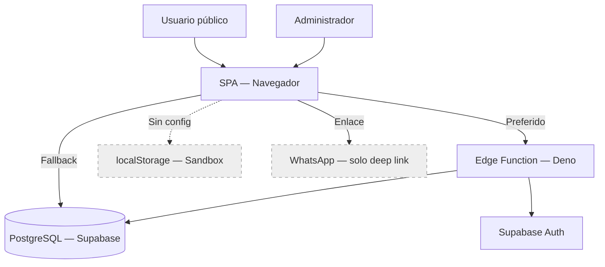
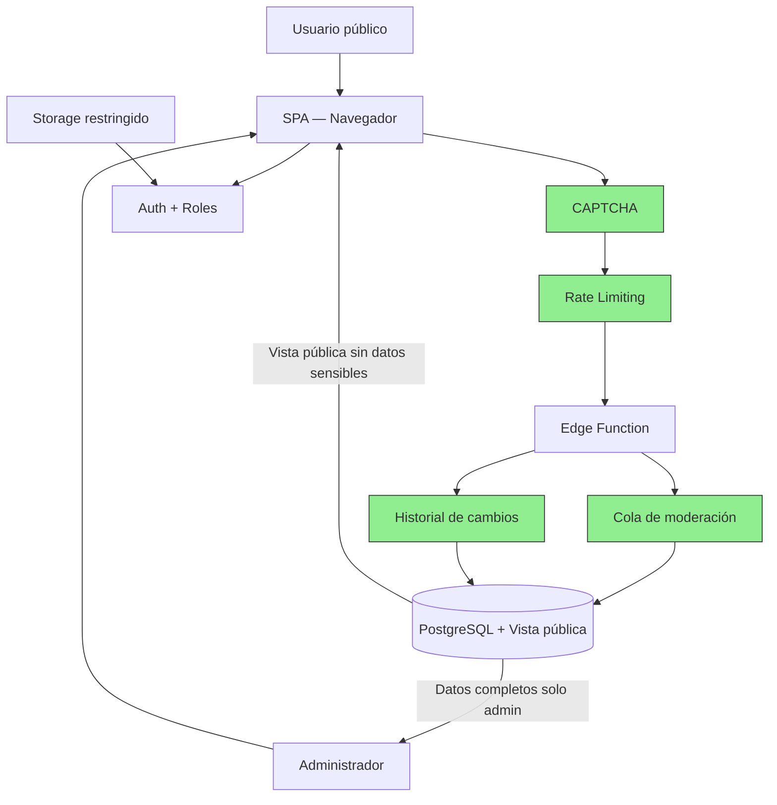

# Auditoría de estado actual — Aquí Estoy Venezuela

> Hallazgos, riesgos, brechas y material para revisión transversal.

## Audiencia

Líderes, auditores, producto, datos, seguridad, desarrollo, DevOps, QA y operaciones.

## Qué responde este documento

Qué riesgos son prioritarios, qué decisiones requieren acuerdo y qué tareas corresponden a cada área.

## Estado y fecha de revisión

- Fecha: 2026-06-29.
- Rama: `docs/audit-and-current-architecture`.
- Referencia local: `8d7dfcb442772099958efc8578db124a7b3a7bff`.
- Estado: revisión documental Codex; no confirma despliegue productivo ni sustituye validación humana.

> Reauditoría independiente (segunda pasada). Rama: `docs/audit-and-current-architecture`. Commit base: `8d7dfcb`.
> Solo se auditó el repositorio `aquiestoyvenezuela-web`.

---

## Metodología

Esta auditoría fue ejecutada por 8 subagentes especializados trabajando secuencialmente:
cartógrafo, analista funcional, revisor frontend/UX/accesibilidad, auditor backend/seguridad,
auditor de datos, auditor DevOps, revisor de PRs/Git, e ingeniero QA.

Cada subagente produjo evidencia independiente verificada contra código, Git, configuración y
pruebas locales. Los hallazgos P0 y P1 recibieron revisión cruzada entre al menos dos auditores.

### Clasificación de evidencia

| Etiqueta | Significado |
|:--------:|-------------|
| **Verificado en código** | El código existe en el repositorio y fue revisado |
| **Probado localmente** | Se ejecutó y verificó en entorno local (sandbox, node, docker) |
| **Observado en HTML** | Evidencia proveniente del DOM serializado de producción |
| **Configurado, no verificado** | Existe configuración en archivos pero no se pudo verificar operación |
| **No encontrado** | Se buscó y no existe evidencia en el repositorio |
| **No verificable** | Requiere acceso a producción o Supabase que no está disponible |

### Limitaciones de la auditoría

- Sin acceso al proyecto Supabase activo (no se verificó RLS real, Auth, Edge Function deploy, Storage)
- Sin acceso al servidor de producción (no se verificó dominio, SSL operativo, Docker corriendo)
- Sin credenciales (no se verificó autenticación real)
- Sin suite de tests (todas las validaciones son estáticas o sandbox)
- HTML observado como evidencia secundaria (no es el index.html del repositorio)
- Ponytail no disponible — auditoría manual de sobreingeniería

---

## Matriz de revisores

| Área | Revisor | Evidencia principal | Hallazgos validados | Confianza |
|------|---------|--------------------|--------------------|:---------:|
| Estructura y baseline | Cartógrafo | git ls-tree, diff, worktree | 11 hallazgos | Alta |
| Funcional y producto | Analista funcional | index.html, app.js, schema.sql, HTML obs. | 20 hallazgos | Alta |
| Frontend, UX, accesibilidad | Frontend specialist | index.html, style.css, app.js, Playwright snaps | 9 hallazgos + 10 WCAG | Alta |
| Backend, Supabase, seguridad | Security auditor | api/index.ts, schema.sql, app.js | 9 hallazgos + correcciones | Alta |
| Calidad de datos | Data quality auditor | app.js (CSV), schema.sql, HTML obs. | 9 patrones de anomalías | Alta |
| DevOps, Docker, Nginx | DevOps auditor | Dockerfile, compose, nginx.conf | 9 hallazgos | Alta |
| PRs y Git | PR/Git reviewer | gh CLI, GitHub API | 2 PRs analizados | Alta |
| QA y validación local | QA engineer | node, sandbox, grep, compose config | 12 pruebas ejecutadas | Alta |

---

## Hallazgos principales

### P0 — Críticos (bloquean uso con datos reales)

| ID | Hallazgo | Área | Evidencia |
|----|----------|------|-----------|
| **SEC-01** | Exposición pública de datos sensibles (RLS SELECT `USING (true)`) | Seguridad | `schema.sql:35-37` |
| **SEC-02** | `verifyAdmin()` no verifica rol — solo autenticación | Seguridad | `api/index.ts:32-42` |
| **SEC-03** | RLS UPDATE/DELETE para cualquier authenticated | Seguridad | `schema.sql:45-54` |
| **BUG-01** | `id="admin-panel"` duplicado — panel admin nunca se muestra | Frontend | `index.html:43,141`, `app.js:42` |
| **BUG-02** | HTTPS redirect rompe contenedor Docker (nginx no inicia) | DevOps | `nginx.conf:7-21`, `docker-compose.yml:7-8` |
| **DAT-01** | Upsert CSV destructivo: revierte "Encontrado" a "Desaparecido" | Datos | `app.js:1458` fuerza estado |
| **DAT-02** | CSV column mapping por substring extremadamente frágil | Datos | `app.js:1430-1447` |

### P1 — Altos

| ID | Hallazgo | Área |
|----|----------|------|
| **SEC-04** | Sin tabla de auditoría de cambios | Seguridad |
| **SEC-05** | Inserción pública sin moderación | Seguridad |
| **DAT-03** | Cédulas duplicadas por formato (formulario vs CSV) | Datos |
| **DAT-04** | Números de documento en campo nombre | Datos |
| **DAT-05** | Edades en campo ubicacion_encontrado | Datos |
| **FUN-01** | Sin botón "Reportar Desaparecido" visible sin buscar | Funcional |
| **FUN-02** | Prevención de duplicados usa ILIKE con substring (falsos positivos) | Funcional |
| **INF-01** | `schema.sql` expuesto públicamente en imagen Docker | DevOps |
| **INF-02** | Sin CI/CD | DevOps |
| **TST-01** | Sin tests automatizados | Calidad |

### P2 — Medios

| ID | Hallazgo | Área |
|----|----------|------|
| **SEC-06** | Sin rate limiting | Seguridad |
| **SEC-07** | Sin CAPTCHA | Seguridad |
| **SEC-08** | Bucket de fotos público con subida sin restricción | Seguridad |
| **SEC-09** | Sin soft delete | Seguridad |
| **SEC-10** | Error leakage en API | Seguridad |
| **SEC-11** | CDN scripts sin SRI integrity | Seguridad |
| **ARC-01** | Version drift: repo (v8/v11/v6) ≠ producción (v13/v12/v7) | Arquitectura |
| **ARC-02** | Proxy /api/ a `apivzla` — dead config, servicio inexistente | Infra |
| **ARC-03** | Tres caminos de ejecución (API, fallback, sandbox) | Arquitectura |
| **ARC-04** | app.js monolítico (1791 líneas) | Código |
| **FUN-03** | Filtro "Apellido" casi nunca funciona | Funcional |
| **FUN-04** | Estadísticas inconsistentes (7211 ≠ 110+147) | Funcional |

---

## Correcciones a la auditoría anterior

| Error previo | Corrección | Evidencia |
|-------------|------------|-----------|
| "RLS a nivel de columna" como solución | **Falso.** RLS controla filas, no columnas. Soluciones correctas: vistas, RPC, select explícito. | Documentación PostgreSQL |
| `SUPABASE_ANON_KEY` tratada como secreta | **Publicable.** Está diseñada para uso en cliente bajo RLS. El service_role es el verdadero secreto. | Documentación Supabase |
| CORS como solución a exposición de datos | **Falso.** CORS solo limita navegadores. Scripts y curl lo ignoran. | HTTP spec |
| "No hay cifrado en reposo" porque no hay código crypto | **Injustificado.** Supabase ofrece cifrado administrado. | Documentación Supabase |
| "No hay backups" porque no hay scripts | **Injustificado.** Supabase ofrece PITR. No se pudo verificar si está habilitado. | Documentación Supabase |
| Proxy Nginx como P0 | **Corregido a P2.** El frontend llama a Supabase directamente, no usa /api/. Es dead config. | `app.js:226` |
| Falta de tests como P0 | **Corregido a P1.** Crítico pero no bloquea uso inmediato. | Análisis de impacto |
| Dockerfile "copia todos los archivos necesarios" | **Falso.** No copia `admin/index.html`. | `Dockerfile:12-21` |

---

## Anomalías del HTML observado

El archivo de HTML observado contiene datos reales de producción. Se identificó:

1. **DOM serializado post-ejecución JS** (contiene tarjetas renderizadas, estadísticas con valores, elementos dinámicos)
2. **Versiones de assets divergentes**: CSS `?v=13`, JS `?v=12`, config `?v=7` vs repo `?v=8`, `?v=11`, `?v=6`
3. **Stats inconsistentes**: 7211 total, 110 buscados, 147 localizados — no suman
4. **Anomalías de campos**: cédulas vacías, ubicaciones con edades, nombres con números de documento
5. **`id="admin-panel"` duplicado** confirmado en el HTML servido
6. **CORS Edge Function fallando** en logs de consola

---

## Pruebas ejecutadas

| Prueba | Resultado |
|--------|:--------:|
| `git ls-tree -r --name-only HEAD` | ✅ 22 archivos trackeados |
| `git diff HEAD origin/main -- <infra files>` | ✅ Sin diferencias (baseline = HEAD) |
| `docker compose config` | ✅ YAML válido |
| `node --check static/js/app.js` | ✅ Sin errores de sintaxis |
| Sandbox mode (búsqueda, stats, admin login) | ✅ Funcional |
| `git diff --check` | ❌ 27 trailing whitespace en README |
| HTML duplicate ID check | ❌ `id="admin-panel"` duplicado |
| Mermaid syntax check | ✅ 11 bloques sin errores |
| `.gitignore` effectiveness | ✅ `config.js` y `.env` correctamente ignorados |
| CSV column mapping simulation | ❌ Bug confirmado (substring matching) |

---

## Matriz de cobertura de la solicitud original

| Requisito original | Documento y sección | Estado | Evidencia |
|-------------------|---------------------|:------:|-----------|
| Qué hace la plataforma | README: Resumen ejecutivo | ✅ | Código + sandbox |
| Cómo se usa | README + HOW_THE_PROJECT_WORKS.md | ✅ | Código + sandbox |
| Cómo viaja un dato | README: Origen y destino | ✅ | Código |
| De dónde proviene la información | README + DATA_SOURCES | ✅ | Código |
| Cómo se valida | README + AUDIT | ✅ | Código (con limitaciones documentadas) |
| Dónde se guarda | README + DATA_SOURCES | ✅ | Código |
| Qué puede ver el público | README: Seguridad | ✅ | schema.sql RLS |
| Qué puede modificar un administrador | README: Capacidades | ✅ | Código |
| Cómo se importan listados | README + DATA_SOURCES | ✅ | Código (con bugs documentados) |
| Qué ocurre al ser localizado | README + HOW_THE_PROJECT_WORKS | ✅ | Código |
| Cómo se despliega | README: Despliegue | ⚠️ | Configurado, no verificado |
| Qué se verificó | README + AUDIT_EXECUTION_LOG | ✅ | Esta auditoría |
| Qué NO se verificó | README + AUDIT_EXECUTION_LOG | ✅ | Esta auditoría |
| Problemas críticos | README + AUDIT | ✅ | 7 hallazgos P0 |
| Trabajo pendiente | README + RECOMMENDED_BACKLOG | ✅ | 5 fases |
| Arquitectura actual | README + ARCHITECTURE | ✅ | Basada en código |
| Arquitectura objetivo | README + ARCHITECTURE | ✅ | Propuesta, separada |
| PRs que requieren atención | README + PULL_REQUEST_REVIEW | ✅ | #12 y #13 |

---

## Revisión conjunta con equipos técnicos y de proyecto

> Material base para una reunión transversal de revisión de hallazgos, arquitectura y prioridades.

## Objetivo de la reunión

Validar los hallazgos de la reauditoría, acordar prioridades, definir responsabilidades por área y establecer el plan de acción para mitigar los riesgos que bloquean el uso del sistema con datos reales.

**Decisiones que deberían obtenerse:**
- Qué datos son públicos y cuáles deben protegerse
- Si se mantiene el fallback directo a Supabase o se centraliza en la Edge Function
- Qué hacer con los PRs #12 y #13
- Cómo se corrige el bug del panel administrativo
- Qué política de moderación y retención se aplica

## Participantes recomendados

| Área | Rol en la reunión |
|------|-------------------|
| Coordinación general | Facilita y valida prioridades |
| Product Manager | Decide qué datos son públicos, flujo de moderación, estados del caso |
| Project Manager / PMO | Define responsables, hitos y dependencias |
| Arquitectura | Define frontera de API, separación pública/privada, arquitectura objetivo |
| Frontend | Corrige bugs HTML, accesibilidad, selectores, PRs |
| Backend | Centraliza validaciones, autorización, auditoría |
| Datos | Normaliza cédulas, valida columnas, trazabilidad de importaciones |
| Seguridad y privacidad | Revisa RLS, roles, rate limiting, protección de menores |
| Infraestructura y DevOps | Valida Docker, hosting, CI/CD, backups, monitoreo |
| QA | Define estrategia de pruebas, automatiza flujos críticos |
| Operaciones | Define proceso de revisión de reportes y escalamiento |
| Privacidad o asesoría legal | Si corresponde, revisa cumplimiento de protección de datos |

## Material previo

| Participante o área | Documento | Secciones recomendadas |
|---------------------|-----------|----------------------|
| Producto | README.md | Resumen ejecutivo, Capacidades, Calidad de datos |
| Proyectos | RECOMMENDED_BACKLOG.md | Fases, dependencias, roadmap |
| Arquitectura | ARCHITECTURE.md | Modos de operación, decisiones, riesgos |
| Frontend | ARCHITECTURE.md + AUDIT_CURRENT_STATE.md | Frontend, BUG-01, accesibilidad |
| Backend | ARCHITECTURE.md + AUDIT_CURRENT_STATE.md | Edge Function, seguridad, SEC-02 |
| Datos | DATA_SOURCES_STORAGE_AND_HOSTING.md | Calidad de datos, importación CSV |
| Seguridad | AUDIT_CURRENT_STATE.md | Hallazgos P0 y P1, RLS, claves |
| DevOps | DATA_SOURCES_STORAGE_AND_HOSTING.md + AUDIT_CURRENT_STATE.md | Infraestructura, BUG-02, INF-01 |
| QA | AUDIT_EXECUTION_LOG.md | Pruebas ejecutadas, limitaciones |
| Operaciones | HOW_THE_PROJECT_WORKS.md + AUDIT_CURRENT_STATE.md | Flujos, limitaciones, calidad |

## Resumen ejecutivo para la reunión

| Tema | Estado actual | Riesgo | Decisión necesaria |
|------|:------------:|:------:|-------------------|
| Datos públicos y privados | Toda la tabla es de lectura pública | P0 | Qué columnas son públicas y cuáles requieren autenticación |
| Registro público | Cualquier persona puede registrar sin verificación | P1 | Si se requiere moderación antes de publicar |
| Moderación | No existe — los reportes se publican inmediatamente | P1 | Definir flujo de aprobación y responsables |
| Calidad de datos | Campos intercambiados, cédulas vacías, formatos inconsistentes | P1 | Definir validaciones mínimas y proceso de corrección |
| Importación CSV | Fuerza estado 'Desaparecido', sobrescribe encontrados | P1 | Si se respeta el estado del CSV o se preserva el existente |
| Administración | Panel admin no se muestra por bug de ID duplicado | P0 | Confirmar el bug y priorizar el fix |
| Arquitectura API/fallback | Dos caminos: Edge Function y Supabase directo | P2 | Si se mantiene el fallback o se centraliza |
| Supabase y RLS | SELECT e INSERT públicos para todos | P0 | Qué política RLS se aplica |
| Fotografías | Bucket configurado pero sin interfaz de carga | P2 | Si se implementa subida de fotos y con qué restricciones |
| Despliegue | Docker con error de HTTPS, sin CI/CD | P0 | Cómo se despliega y dónde |
| Testing | Sin pruebas automatizadas | P1 | Qué estrategia de testing se adopta |
| Pull requests | #12 y #13 abiertos, en conflicto, sin reviews | P2 | Orden de merge y coordinación entre autores |

## Arquitectura levantada

### Resumen de la arquitectura actual

SPA vanilla JS (HTML/CSS/JS sin framework ni build) que se comunica con Supabase como backend. Tiene tres modos de operación: Edge Function (preferido), Supabase JS directo (fallback), y localStorage (sandbox sin backend).

### Diagrama ejecutivo — arquitectura actual



### Diagrama ejecutivo — arquitectura objetivo



> Componentes verdes son propuestos. Ver [ARCHITECTURE.md](./ARCHITECTURE.md) para el detalle técnico.

### Tabla comparativa

| Área | Arquitectura actual | Arquitectura objetivo | Brecha |
|------|---------------------|----------------------|--------|
| Frontend | SPA vanilla JS, monolítico | SPA modular con separación de responsabilidades | Media |
| API | Edge Function con fallback directo a Supabase | Edge Function como única frontera | Alta |
| Datos | Tabla única con SELECT público total | Vista pública + tabla base con acceso restringido | Alta |
| Autenticación | Supabase Auth (email + contraseña) | Supabase Auth + roles (admin, moderador, visor) | Alta |
| Autorización | verifyAdmin() solo verifica autenticación | Verificación de rol real en cada endpoint | Crítica |
| Storage | Bucket público sin restricciones | Bucket restringido con validación de tipo y tamaño | Media |
| Infraestructura | Docker con error HTTPS, sin CI/CD | Docker funcional + CI/CD + staging | Alta |
| Observabilidad | Sin monitoreo ni logs | Health checks + logging estructurado + alertas | Alta |
| Auditoría | Sin historial de cambios | Tabla de auditoría con trigger automático | Alta |

## Hallazgos que requieren acuerdo

| ID | Hallazgo | Áreas involucradas | Decisión requerida | Riesgo de postergar |
|----|----------|-------------------|-------------------|---------------------|
| SEC-01 | Datos sensibles públicos | Producto, Seguridad, Backend | Qué columnas son públicas | Exposición continua de datos personales |
| SEC-02 | verifyAdmin() sin verificación de rol | Backend, Seguridad | Cómo se implementan roles | Cualquier usuario autenticado es admin |
| BUG-01 | Panel admin no visible | Frontend, Producto | Confirmar y priorizar el fix | Administradores no pueden operar |
| BUG-02 | Docker no inicia por HTTPS | DevOps, Infraestructura | Cómo se gestiona TLS | No se puede desplegar vía Docker |
| DAT-01 | CSV import revierte encontrados | Datos, Backend, Producto | Si se preserva el estado existente | Pérdida de datos de localización |
| DAT-02 | Mapeo CSV por substring frágil | Datos, Frontend | Si se cambia a mapeo exacto | Campos intercambiados en producción |
| FUN-01 | Sin botón "Reportar" visible | Producto, Frontend | Si se agrega CTA global | Ciudadanos no pueden reportar sin buscar primero |

## Preguntas abiertas

### Producto

- Qué información debe mostrarse públicamente y cuál debe protegerse
- Qué significa que un caso esté "verificado"
- Si los reportes se publican inmediatamente o requieren moderación
- Qué estados necesita el caso además de Desaparecido y Encontrado
- Quién puede corregir información incorrecta

### Datos

- Cuál es la fuente oficial de datos
- Cómo se identifica un duplicado de forma confiable
- Cómo se corrigen registros incompletos o con campos intercambiados
- Cómo se evita sobrescribir estados verificados durante importaciones
- Qué trazabilidad debe conservarse para cada registro

### Seguridad y privacidad

- Qué campos deben ser privados
- Cómo se protege la información de menores de edad
- Qué permisos requiere cada rol administrativo
- Qué política de retención se necesita
- Cómo se atienden solicitudes de corrección o eliminación de datos

### Arquitectura y desarrollo

- Si debe mantenerse el fallback directo a Supabase o centralizar en la Edge Function
- Cuál será la frontera oficial de API
- Cómo se separa información pública y privada a nivel de base de datos
- Qué ambientes se necesitan (producción, staging, desarrollo)
- Qué componentes deben desplegarse y en qué orden

### Infraestructura

- Dónde está desplegado realmente el sistema actualmente
- Cómo se gestionan secretos y variables de entorno
- Cómo se realizan backups y con qué frecuencia
- Cómo se monitorea la disponibilidad
- Cómo se revierte un despliegue fallido

### Operación y proyecto

- Quién revisa reportes públicos antes de su publicación (si se implementa moderación)
- Quién valida las fuentes de datos para importación
- Qué SLA se espera para actualizaciones de estado
- Cómo se escalan incidentes de seguridad o datos
- Cómo se gestionan las prioridades entre correcciones de bugs y nuevas funcionalidades

## Tareas recomendadas por área

> Ver [RECOMMENDED_BACKLOG.md](./RECOMMENDED_BACKLOG.md) para el detalle completo de cada tarea.

| Área | Tarea recomendada | Prioridad | Dependencias | Resultado esperado | Referencia |
|------|-------------------|:---------:|:------------:|-------------------|:----------:|
| Frontend | Eliminar `id="admin-panel"` duplicado | P0 | Ninguna | Panel admin visible tras login | BUG-01 |
| DevOps | Corregir nginx.conf para que Docker pueda iniciar | P0 | Ninguna | Contenedor funcional | BUG-02 |
| Backend | Implementar verificación real de rol en verifyAdmin() | P0 | Definir roles | Solo admins pueden modificar | SEC-02 |
| Seguridad | Crear vista pública sin columnas sensibles | P0 | Decisión de producto | Datos privados no expuestos | SEC-01 |
| Datos | Corregir CSV import para no forzar estado | P1 | Ninguna | Preservar estados verificados | DAT-01 |
| Datos | Cambiar mapeo CSV de substring a exacto | P1 | Ninguna | Campos correctos | DAT-02 |
| Frontend | Agregar botón "Reportar" visible | P1 | Ninguna | Ciudadanos pueden reportar | FUN-01 |
| Backend | Implementar tabla de auditoría | P1 | T-101 | Historial de cambios | SEC-04 |
| Producto | Definir qué datos son públicos | P0 | Ninguna | Criterio para vista pública | SEC-01 |
| Producto | Definir flujo de moderación | P1 | Decisión de producto | Reportes revisados antes de publicar | SEC-05 |
| DevOps | Implementar CI/CD mínimo | P2 | Ninguna | Deploy automatizado | INF-02 |
| QA | Definir estrategia de pruebas | P1 | Ninguna | Suite de tests inicial | TST-01 |
| Datos | Normalizar cédulas en todas las vías | P1 | Ninguna | Una cédula = un registro | DAT-03 |
| Seguridad | Implementar rate limiting | P2 | Ninguna | Protección contra abuso | SEC-06 |
| Seguridad | Implementar CAPTCHA | P2 | Ninguna | Verificación humana | SEC-07 |

## Matriz de decisiones

| ID | Decisión | Opciones | Recomendación de auditoría | Área que decide | Fecha objetivo |
|----|----------|----------|---------------------------|-----------------|:--------------:|
| DEC-01 | Qué columnas son públicas | (a) Solo nombre+estado+ubicación (b) Todo menos teléfono y observaciones (c) Actual | Opción (a) | Producto + Seguridad | Por definir en reunión |
| DEC-02 | Cómo separar datos públicos/privados | (a) Vista pública (b) Select explícito en API (c) Tabla separada | (a) + (b) | Arquitectura + Backend | Por definir en reunión |
| DEC-03 | Si se mantiene el fallback directo | (a) Mantener (b) Eliminar (c) Mantener con validaciones adicionales | (c) | Arquitectura | Por definir en reunión |
| DEC-04 | Orden de merge PR #12 y #13 | (a) #13 primero (b) #12 primero (c) PR de integración | (a) | Frontend + Mantenedores | Por definir en reunión |
| DEC-05 | Política de moderación | (a) Sin moderación (b) Moderación obligatoria (c) Moderación opcional | (b) | Producto | Por definir en reunión |
| DEC-06 | Cómo se gestiona TLS en Docker | (a) TLS en contenedor (b) Reverse proxy externo (c) Sin TLS | (b) | DevOps | Por definir en reunión |
| DEC-07 | Estrategia de testing | (a) Sin tests (b) Tests unitarios mínimos (c) Suite completa | (b) | QA + Arquitectura | Por definir en reunión |

## Agenda propuesta (60-90 minutos)

| Tiempo | Tema | Resultado esperado |
|------:|------|-------------------|
| 5 min | Contexto y objetivo de la reunión | Alineamiento sobre el propósito |
| 10 min | Estado actual del proyecto | Validación de hallazgos P0 |
| 15 min | Arquitectura actual y brechas | Acuerdo sobre arquitectura objetivo |
| 15 min | Seguridad, privacidad y calidad de datos | Decisiones DEC-01 a DEC-05 |
| 10 min | Pull requests y riesgos técnicos | Decisión DEC-04 |
| 15 min | Backlog y prioridades | Acuerdo de prioridades P0 y P1 |
| 10 min | Decisiones y próximos pasos | Responsables y fechas objetivo |

## Resultados esperados

La reunión debería terminar con:
- Hallazgos P0 validados o descartados
- Decisiones registradas en la matriz de decisiones
- Prioridades acordadas para P0 y P1
- Responsables por área definidos por el equipo
- Dependencias identificadas
- Tareas convertibles en issues de GitHub
- Fecha de siguiente revisión
- Riesgos aceptados o mitigados explícitamente
- Arquitectura objetivo validada o enviada a revisión

## Acta de reunión

```markdown
## Acta de revisión

- Fecha:
- Participantes:
- Facilitador:
- Objetivo:

### Decisiones

| ID | Decisión | Área responsable | Fecha objetivo |
|---|---|---|---|

### Acciones

| ID | Acción | Área | Prioridad | Dependencia | Estado |
|---|---|---|---|---|---|

### Riesgos aceptados

| Riesgo | Justificación | Condición de revisión |
|---|---|---|

### Temas pendientes

| Tema | Información necesaria | Próxima acción |
|---|---|---|

### Próxima reunión

- Fecha:
- Objetivo:
```

## Estados documentales usados

| Estado | Significado |
|---|---|
| Verificado en código | Confirmado en archivos del repositorio local. |
| Probado localmente | Ejecutado en esta revisión y observado localmente. |
| Observado | Visto en evidencia externa o herramienta, indicando fecha/fuente. |
| Configurado, no verificado | Existe configuración, pero no se probó el servicio real. |
| Documentado, no implementado | Aparece en documentación, no se encontró implementación. |
| Propuesto | Recomendación o arquitectura objetivo. |
| No encontrado | Se buscó evidencia y no apareció. |
| No verificable | Requiere acceso, ambiente o decisión fuera de esta revisión. |
