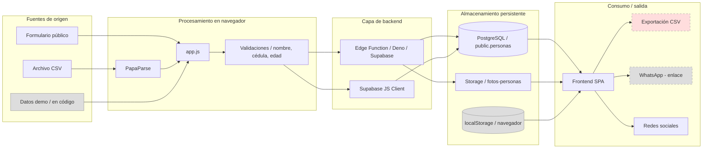
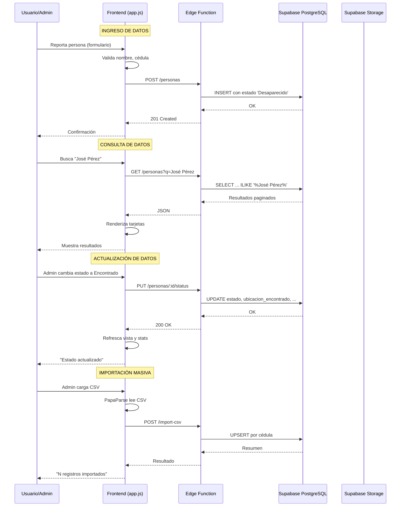

# Fuentes de datos, almacenamiento y alojamiento

> Origen, recorrido, almacenamiento, exposición y hosting del dato.

## Audiencia

Datos, backend, infraestructura, seguridad y operación.

## Qué responde este documento

De dónde vienen los datos, cómo se almacenan, qué se expone y qué no está verificado.

## Estado y fecha de revisión

- Fecha: 2026-06-29.
- Rama: `docs/audit-and-current-architecture`.
- Referencia local: `8d7dfcb442772099958efc8578db124a7b3a7bff`.
- Estado: revisión documental Codex; no confirma despliegue productivo ni sustituye validación humana.

> Documento detallado sobre el origen, flujo, almacenamiento y despliegue de los datos en Aquí Estoy Venezuela.

---


## Estados documentales usados

| Estado | Significado |
|---|---|
| Verificado en código | Confirmado en archivos del repositorio local. |
| Probado localmente | Ejecutado en esta revisión y observado localmente. |
| Observado | Visto en evidencia externa o herramienta, indicando fecha/fuente. |
| Configurado, no verificado | Existe configuración, pero no se probó el servicio real. |
| Documentado, no implementado | Aparece en documentación, no se encontró implementación. |
| Propuesto | Recomendación o arquitectura objetivo. |
| No encontrado | Se buscó evidencia y no apareció. |
| No verificable | Requiere acceso, ambiente o decisión fuera de esta revisión. |

## Índice

- [Mapa general de datos](#mapa-general-de-datos)
- [Fuentes de datos](#fuentes-de-datos)
  - [1. Formulario público de registro](#1-formulario-público-de-registro)
  - [2. Importación CSV](#2-importación-csv)
  - [3. Datos de demostración (seed)](#3-datos-de-demostración-seed)
- [Almacenamiento de datos](#almacenamiento-de-datos)
  - [Base de datos PostgreSQL (Supabase)](#base-de-datos-postgresql-supabase)
  - [Supabase Storage (bucket fotos-personas)](#supabase-storage-bucket-fotos-personas)
  - [Almacenamiento local del navegador](#almacenamiento-local-del-navegador)
- [Alojamiento e infraestructura](#alojamiento-e-infraestructura)
  - [Supabase (backend como servicio)](#supabase-backend-como-servicio)
  - [Servidor web / frontend](#servidor-web--frontend)
  - [Dominio y SSL](#dominio-y-ssl)
- [Flujo completo del dato](#flujo-completo-del-dato)
- [Políticas de respaldo, retención y eliminación](#políticas-de-respaldo-retención-y-eliminación)
- [Brechas y riesgos identificados](#brechas-y-riesgos-identificados)

---

## Mapa general de datos



---

## Fuentes de datos

### 1. Formulario público de registro

| Propiedad | Valor |
|-----------|-------|
| **Canal** | Web (navegador del usuario) |
| **Formato** | JSON vía API REST |
| **Responsable** | Usuario público (sin registro) |
| **Validación** | Nombre y cédula obligatorios en frontend; verificación de duplicado por cédula |
| **Estado** | **Implementado** |

**Flujo**:

```
Usuario completa formulario
  → app.js valida campos obligatorios (nombre, cedula)
  → app.js consulta si la cédula ya existe (GET /personas?q=cedula&category=cedula)
  → Si no existe duplicado → POST /personas
  → Edge Function o Supabase inserta con estado 'Desaparecido'
  → Confirmación al usuario
```

**Datos recolectados**:

| Campo | Tipo | Obligatorio | Origen |
|-------|------|:-----------:|--------|
| nombre | text | Sí | Input del usuario |
| cedula | text | Sí | Input del usuario |
| edad | integer | No | Input del usuario |
| telefono_contacto | text | No | Input del usuario |
| ultima_ubicacion | text | No | Input del usuario |
| observaciones | text | No | Input del usuario |
| es_menor | boolean | Sí (default false) | Marcado manual o por edad < 18 |

---

### 2. Importación CSV

| Propiedad | Valor |
|-----------|-------|
| **Canal** | Panel administrativo de la web |
| **Formato** | Archivo CSV procesado en el navegador |
| **Responsable** | Administrador autenticado |
| **Validación** | Cada fila debe tener nombre y cédula; detección de columnas por nombre; marca menores por edad |
| **Estado** | **Implementado** |

**Mapeo inteligente de columnas**:

El frontend (app.js) identifica columnas buscando nombres que contengan:

| Columna buscada | Nombres aceptados |
|:---------------:|-------------------|
| nombre | `nom`, `nombre`, `name`, `nombres`, `fullname` |
| cedula | `ced`, `cédula`, `cedula`, `ci`, `id`, `identificación`, `identificacion`, `documento` |
| edad | `edad`, `age`, `ed` |
| ultima_ubicacion | `ubicacion`, `ultima_ubicacion`, `location`, `dirección`, `direccion` |
| telefono_contacto | `telefono`, `teléfono`, `phone`, `contacto`, `tlf`, `celular` |
| observaciones | `observaciones`, `notes`, `comentarios`, `description`, `señas` |
| estado | `estado`, `status`, `state` |

**Flujo**:

```
Admin autenticado selecciona archivo CSV
  → PapaParse (CDN) lee el archivo en el navegador
  → Para cada fila:
      → Mapea columnas por nombre (case-insensitive)
      → Skipea si falta nombre o cédula
      → Si edad < 18 → marca es_menor = true
      → Acumula en array de registros válidos
  → Si hay registros válidos:
      → POST /import-csv (Edge Function) o
      → supabase.from('personas').upsert(rows, { onConflict: 'cedula' })
  → Muestra resumen: "X insertados, Y actualizados, Z saltados"
```

**Diferencia clave**: La importación CSV usa **upsert** (update si existe cédula, insert si no existe), mientras que el formulario público rechaza duplicados.

---

### 3. Datos de demostración (seed)

| Origen | Ubicación | Contenido | Formato |
|--------|-----------|-----------|---------|
| schema.sql | Líneas al final del archivo | 4 personas ficticias | SQL INSERT |
| app.js | Modo sandbox | 5 personas ficticias | Array de objetos JS |

**schema.sql — seed data**:

```sql
INSERT INTO public.personas (nombre, cedula, edad, ultima_ubicacion, estado, observaciones) VALUES
('María García', 'V-12345678', 32, 'Caracas', 'Desaparecido', 'Vestía camisa azul'),
('Pedro Sánchez', 'V-23456789', 28, 'Valencia', 'Desaparecido', '...'),
('Ana Rodríguez', 'V-34567890', 45, 'Maracaibo', 'Encontrado', '...'),
('Luis Martínez', 'V-45678901', 15, 'Barquisimeto', 'Desaparecido', '...');
```

**app.js — demo data**: 5 personas generadas con datos ficticios directamente en el código, almacenadas en localStorage bajo la clave `personas`.

---

## Almacenamiento de datos

### Base de datos PostgreSQL (Supabase)

| Propiedad | Valor |
|-----------|-------|
| **Tecnología** | PostgreSQL (proveído por Supabase) |
| **Tabla principal** | `public.personas` |
| **Extensiones** | `pg_trgm` (para búsqueda por trigramas) |
| **Backups** | No verificados |

**Columnas** (`public.personas`):

| Columna | Tipo | Constraints |
|---------|------|-------------|
| id | bigint | PK, GENERATED ALWAYS AS IDENTITY |
| nombre | text | NOT NULL |
| cedula | text | NOT NULL, UNIQUE |
| edad | integer | |
| ultima_ubicacion | text | |
| telefono_contacto | text | |
| observaciones | text | |
| estado | text | NOT NULL, DEFAULT 'Desaparecido', CHECK (estado IN ('Desaparecido', 'Encontrado')) |
| ubicacion_encontrado | text | |
| encontrado_por | text | |
| encontrado_por_cedula | text | |
| es_menor | boolean | NOT NULL, DEFAULT false |
| foto_url | text | |
| fecha_registro | timestamptz | NOT NULL, DEFAULT now() |
| fecha_actualizacion | timestamptz | NOT NULL, DEFAULT now() |

**Total de columnas**: 16

**Consumo estimado**:
- Cada fila ocupa ~200-500 bytes dependiendo de la longitud de los campos de texto
- 10,000 registros ≈ 2-5 MB de datos
- 100,000 registros ≈ 20-50 MB

### Supabase Storage (bucket fotos-personas)

| Propiedad | Valor |
|-----------|-------|
| **Bucket** | `fotos-personas` |
| **Política** | Pública (lectura y subida) |
| **Configuración** | Definido en schema.sql |
| **Interfaz de carga** | **No implementada** |
| **Estado** | Bucket creado pero sin funcionalidad de uso |

**Política del bucket** (desde schema.sql):

```sql
-- Bucket público para fotos
INSERT INTO storage.buckets (id, name, public) VALUES ('fotos-personas', 'fotos-personas', true);

-- Políticas: todo público (lectura y subida)
CREATE POLICY "Acceso público fotos" ON storage.objects
    FOR SELECT USING (bucket_id = 'fotos-personas');

CREATE POLICY "Subida pública fotos" ON storage.objects
    FOR INSERT WITH CHECK (bucket_id = 'fotos-personas');
```

> **Riesgo**: El bucket es público para lectura Y subida. Cualquier persona podría subir archivos al bucket sin autenticación.

### Almacenamiento local del navegador

| Almacenamiento | Clave(s) | Contenido | Persistencia | Uso |
|---------------|----------|-----------|:------------:|:---:|
| localStorage | `personas` | Array de objetos con datos demo | Hasta que se limpie manualmente | Modo sandbox |
| localStorage | `admin_session_demo` | Objeto de sesión admin ficticia | Hasta que se limpie manualmente | Modo sandbox |
| sessionStorage | `triggerAdminLogin` | Flag de redirección admin | Se elimina al leerlo | Redirección /admin |
| Cookies | Varias (Supabase Auth) | Tokens de sesión JWT | Hasta expiración | Modo real |

---

## Alojamiento e infraestructura

### Supabase (backend como servicio)

Supabase provee los siguientes servicios como plataforma:

| Servicio | Rol en el sistema | ¿Verificado? |
|----------|-------------------|:------------:|
| **PostgreSQL** | Base de datos principal de personas | No |
| **Edge Functions** | API REST (Deno) | No |
| **Auth** | Autenticación de administradores | No |
| **Storage** | Almacenamiento de fotos | No |

**Nota**: No se pudo verificar si existe un proyecto Supabase activo para este sistema. El código está configurado para usar uno, pero no hay evidencia de que esté operativo.

### Servidor web / frontend

| Componente | Tecnología | Propósito | Estado |
|-----------|-----------|-----------|:------:|
| Contenedor | Docker (nginx:alpine) | Servir el frontend | **Configurado** |
| Servidor web | Nginx | Servir archivos estáticos + proxy /api/ + SSL | **Configurado** |
| Orquestación | docker-compose.yml | Definición del servicio web | **Configurado** |

**Problema conocido**: El `nginx.conf` incluye:

```nginx
location /api/ {
    proxy_pass http://apivzla/;
}
```

El servicio `apivzla` **no está definido** en `docker-compose.yml`. Esto significa que el proxy hacia la API no es funcional desde el contenedor Docker. La comunicación con la Edge Function se haría directamente a la URL de Supabase desde el frontend.

### Dominio y SSL

| Propiedad | Valor |
|-----------|-------|
| **Dominio** | aquiestoyvenezuela.com, www.aquiestoyvenezuela.com |
| **SSL** | Let's Encrypt (configurado en nginx.conf) |
| **Certificados** | `/etc/letsencrypt/live/aquiestoyvenezuela.com/` |
| **Redirección** | HTTP → HTTPS forzada |
| **Estado** | **No verificado** — no se pudo confirmar que el dominio esté activo |

**Configuración en nginx.conf**:

```nginx
server {
    listen 80;
    server_name aquiestoyvenezuela.com www.aquiestoyvenezuela.com;
    return 301 https://$server_name$request_uri;
}

server {
    listen 443 ssl;
    server_name aquiestoyvenezuela.com www.aquiestoyvenezuela.com;

    ssl_certificate /etc/letsencrypt/live/aquiestoyvenezuela.com/fullchain.pem;
    ssl_certificate_key /etc/letsencrypt/live/aquiestoyvenezuela.com/privkey.pem;

    # Headers de seguridad
    add_header Strict-Transport-Security "max-age=31536000; includeSubDomains" always;
    add_header X-Content-Type-Options nosniff;
    add_header X-Frame-Options SAMEORIGIN;
    add_header Referrer-Policy strict-origin-when-cross-origin;

    location / {
        root /usr/share/nginx/html;
        try_files $uri $uri/ /index.html;
    }

    location /api/ {
        proxy_pass http://apivzla/;  # ← Servicio NO definido en docker-compose.yml
    }
}
```

---

## Flujo completo del dato

### De origen a pantalla



---

## Políticas de respaldo, retención y eliminación

### Respaldo (backup)

| Aspecto | Estado |
|---------|:------:|
| Backup automático de base de datos | **No encontrado** |
| Script de backup | **No existe** |
| Herramienta configurada | **No existe** |
| schema.sql como backup de estructura | Sí — permite recrear la estructura pero no los datos |

**Supabase** ofrece backups automáticos del proyecto (point-in-time recovery) pero:
- No se pudo verificar que el proyecto Supabase exista
- No se pudo verificar que los backups estén habilitados
- No hay documentación en el repositorio sobre la configuración de backups

### Retención

| Aspecto | Estado |
|---------|:------:|
| Política de retención documentada | **No existe** |
| Archivado automático de casos resueltos | **No existe** |
| Límite de tiempo para mantener registros | **No existe** |
| Mecanismo de cierre de casos | **No existe** |

Los registros permanecen en la base de datos indefinidamente hasta que un administrador los elimine manualmente.

### Eliminación

| Aspecto | Estado | Riesgo |
|---------|:------:|:------:|
| Eliminación física (DELETE) | **Sí** — el endpoint DELETE borra permanentemente | **Alto** |
| Soft delete (borrado lógico) | **No existe** | Un error elimina datos irrecoverables |
| Confirmación de eliminación | `confirm()` del navegador | Fácil de omitir accidentalmente |
| Auditoría de eliminación | **No existe** | No queda registro de qué se eliminó ni quién lo hizo |
| Recuperación post-eliminación | **No existe** | Datos perdidos permanentemente |

---

## Calidad de datos

> Centralizar información no garantiza que cada dato sea correcto. La auditoría encontró múltiples problemas de calidad que afectan la confiabilidad del sistema.

### Problemas identificados

| ID | Patrón | Evidencia anonimizada | Origen probable | Impacto | Severidad |
|----|--------|----------------------|-----------------|:-------:|:---------:|
| DAT-Q1 | Cédulas vacías en pantalla | Cards con campo "Cédula:" sin valor | Columna CSV no mapeada o celda vacía | Usuario no puede verificar identidad | Crítica |
| DAT-Q2 | Números de documento en campo nombre | "NOMBRE APELLIDO 5.114.187" | CSV fuente con campos concatenados | Búsqueda por nombre falla | Crítica |
| DAT-Q3 | Edades en campo de ubicación | "39 años", "45 AÑOS - TANAGUARENAS" | Admin ingresó datos compuestos en formulario de estado | Información de localización inservible | Alta |
| DAT-Q4 | Prefijos numéricos en ubicaciones | "22_LA GUAIRA" | Datos CSV sin limpiar | Búsqueda por ubicación devuelve ruido | Alta |
| DAT-Q5 | Comillas literales en observaciones | '"Artigas"' | CSV con quoting anómalo | Dato técnicamente incorrecto | Baja |
| DAT-Q6 | Cédulas duplicadas por formato | V-12345678 vs V-12.345.678 vs 12345678 | Formulario normaliza; CSV no normaliza | Misma persona con dos registros | Alta |
| DAT-Q7 | Upsert destructivo | Persona "Encontrado" vuelve a "Desaparecido" | CSV import fuerza estado='Desaparecido' | Pérdida irreversible de datos de localización | Crítica |
| DAT-Q8 | Estadísticas inconsistentes | Total ≠ desaparecidos + encontrados | Posible mezcla sandbox/Supabase o versiones de código diferentes | Desconfianza en los números | Alta |

### Análisis del mapeo de columnas CSV

El importador (`app.js:1430-1447`) identifica columnas por coincidencia de substrings:

| Prioridad | Keywords | Campo asignado | Riesgo |
|:---------:|----------|:--------------:|-------|
| 1 | `nom`, `apell` | nombre | `'apell'` puede capturar columnas que no son nombre |
| 2 | `ced`, `ci`, `doc`, `ident` | cedula | **`'ci'` matchea dentro de `'ubicaCIón'` y `'observaCIones'`** |
| 3 | `edad`, `age`, `ano` | edad | Bajo riesgo |
| 4 | `loc`, `ubi`, `dire` | ultima_ubicacion | `'dire'` puede capturar columnas de dirección que no son ubicación |
| 5 | `obs`, `det`, `sen` | observaciones | Bajo riesgo |

> [!WARNING]
> El bug del keyword `'ci'` hace que columnas de ubicación u observaciones sobrescriban el campo cédula. Esto explica las cédulas vacías y los campos intercambiados observados en producción.

### Columnas no mapeadas

El importador **no mapea** `telefono_contacto`, `estado`, `ubicacion_encontrado`, `encontrado_por`, ni `encontrado_por_cedula`. Si el CSV contiene estas columnas, los datos se pierden silenciosamente sin reportar al administrador.

### Validaciones existentes y faltantes

| Validación | Existe | Dónde |
|-----------|:------:|-------|
| Nombre y cédula obligatorios | Sí | `app.js:1430`, `api/index.ts:248` |
| Detección de menores por edad < 18 | Sí (solo cliente) | `app.js:1450` |
| Normalización de cédula | Parcial | Formulario sí (`app.js:106-112`); CSV no |
| Validación de contenido de campos | No | — |
| Reporte de filas rechazadas | No | Solo cuenta total, no detalle |
| Trazabilidad de origen | No | Sin campo `origen` en schema |
| Prevención de sobrescritura de estados | No | Upsert sobrescribe todo |
| Detección de campos intercambiados | No | — |

### Recomendaciones de calidad de datos

1. Normalizar cédulas en todas las vías de ingreso (formulario y CSV)
2. Cambiar mapeo CSV de substring a coincidencia exacta de palabras
3. Agregar campo `origen` a la tabla para trazabilidad
4. Reportar filas rechazadas con motivo al administrador
5. No sobrescribir estados verificados durante upsert
6. Validar contenido de campos (ej: una ubicación no debería contener "años")
7. Agregar métricas de completitud, validez, unicidad y consistencia

---

## Brechas y riesgos identificados

| ID | Brecha | Impacto | Prioridad |
|----|--------|:-------:|:---------:|
| DAT-01 | **Sin política de backup documentada** — Supabase puede tener PITR pero no se verificó | No se puede garantizar recuperación de datos | **P1** |
| DAT-02 | **Eliminación sin recuperación** | No hay soft delete ni papelera de reciclaje | **P1** |
| DAT-03 | **Bucket de fotos público** | Cualquier persona puede subir archivos al bucket | **P1** |
| DAT-04 | **Mapeo CSV por substring frágil** | `'ci'` matchea dentro de `'ubicaCIón'` — campos intercambiados | **P1** |
| DAT-05 | **CSV import fuerza estado 'Desaparecido'** | Sobrescribe personas localizadas | **P0** |
| DAT-06 | **Sin límite de tamaño en subida CSV** | Un archivo CSV muy grande puede congelar el navegador | P2 |
| DAT-07 | **Sin política de retención** | No hay reglas sobre cuándo archivar o eliminar datos antiguos | P3 |
| DAT-08 | **Cédulas no normalizadas en CSV** | Duplicados por formato (V-123 vs V-12.3) | **P1** |
| DAT-09 | **Sin trazabilidad de origen** | No se sabe si un registro vino del formulario, CSV o manual | P2 |
