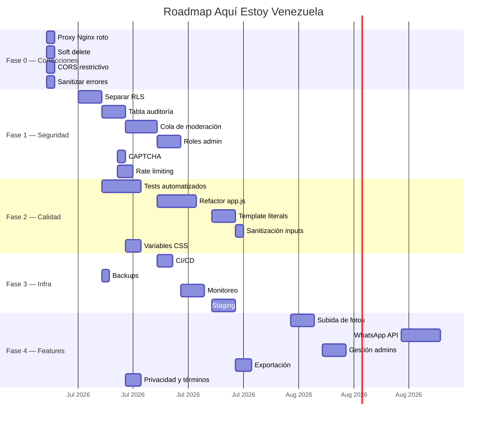
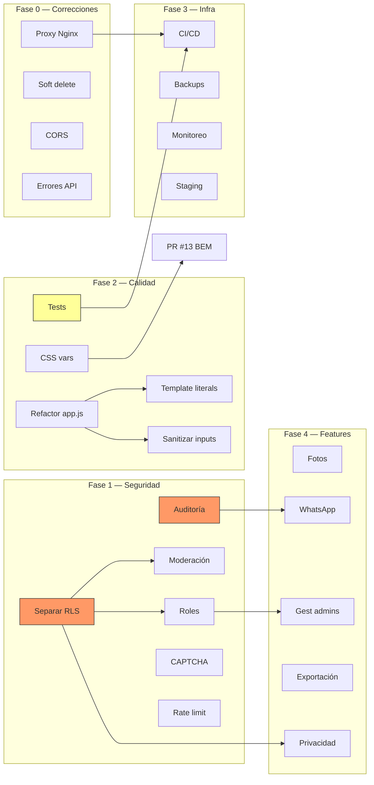

# Backlog recomendado

> Backlog priorizado y accionable derivado de los hallazgos.

## Audiencia

Producto, gestión de proyectos, desarrollo, datos, seguridad, DevOps, QA y operaciones.

## Qué responde este documento

Qué hacer primero, con qué dependencia, criterio de aceptación y decisión requerida.

## Estado y fecha de revisión

- Fecha: 2026-06-29.
- Rama: `docs/audit-and-current-architecture`.
- Referencia local: `8d7dfcb442772099958efc8578db124a7b3a7bff`.
- Estado: revisión documental Codex; no confirma despliegue productivo ni sustituye validación humana.

> Lista priorizada de tareas para mejorar Aquí Estoy Venezuela, con estimaciones de esfuerzo, dependencias y criterios de éxito.

---

## Índice

- [Cómo usar este backlog](#cómo-usar-este-backlog)
- [Fase 0 — Correcciones inmediatas](#fase-0--correcciones-inmediatas)
- [Fase 1 — Seguridad y privacidad (Crítica)](#fase-1--seguridad-y-privacidad-crítica)
- [Fase 2 — Calidad y mantenibilidad (Alta)](#fase-2--calidad-y-mantenibilidad-alta)
- [Fase 3 — Infraestructura (Media)](#fase-3--infraestructura-media)
- [Fase 4 — Funcionalidades (Media-Baja)](#fase-4--funcionalidades-media-baja)
- [Fase 5 — Vision (Futuro)](#fase-5--visión-futuro)
- [Roadmap visual](#roadmap-visual)
- [Dependencias entre tareas](#dependencias-entre-tareas)

---

## Cómo usar este backlog

Cada tarea incluye:

| Campo | Descripción |
|-------|-------------|
| **ID** | Identificador único |
| **Título** | Nombre de la tarea |
| **Prioridad** | P0 (crítico) a P4 (futuro) |
| **Esfuerzo** | Estimación en días-hombre |
| **Dependencias** | IDs de tareas que deben completarse antes |
| **Archivos afectados** | Archivos que probablemente cambien |
| **Criterio de éxito** | ¿Cómo saber si está completo? |
| **Notas** | Riesgos, decisiones, contexto |

---

## Fase 0 — Correcciones inmediatas

> Tareas que pueden ejecutarse en cualquier orden y no requieren diseño previo. Son parches puntuales.

### T-001: Corregir proxy Nginx roto

| Campo | Valor |
|-------|-------|
| **Prioridad** | P0 |
| **Esfuerzo** | ⏱️ 1 hora |
| **Archivos** | `nginx.conf`, `docker-compose.yml` |
| **Dependencias** | Ninguna |

**Descripción**: El proxy `/api/` en `nginx.conf` apunta a `http://apivzla/`, servicio que no existe en `docker-compose.yml`. La Edge Function de Supabase se sirve desde la infraestructura de Supabase, no desde un contenedor Docker. Dos opciones:
1. Eliminar el bloque `location /api/` del nginx.conf (si la app se comunica directamente con Supabase).
2. O crear un servicio `apivzla` en docker-compose.yml para la Edge Function (más complejo y no recomendado sin CI/CD).

**Criterio de éxito**: `nginx.conf` ya no referencia servicios inexistentes.

---

### T-002: Agregar soft delete

| Campo | Valor |
|-------|-------|
| **Prioridad** | P0 |
| **Esfuerzo** | ⏱️ 1 día |
| **Archivos** | `schema.sql`, `supabase/functions/api/index.ts`, `static/js/app.js` |
| **Dependencias** | Ninguna |

**Descripción**: En lugar de DELETE físico, agregar columna `deleted_at timestamptz` y modificar las consultas para excluir registros con `deleted_at IS NOT NULL`. Mantener DELETE físico como opción administrativa (con confirmación extra).

**Criterio de éxito**: Un registro eliminado se marca como borrado pero permanece en la base de datos y puede ser recuperado por un administrador.

---

### T-003: CORS restrictivo en Edge Function

| Campo | Valor |
|-------|-------|
| **Prioridad** | P1 |
| **Esfuerzo** | ⏱️ 1 hora |
| **Archivos** | `supabase/functions/api/index.ts` |
| **Dependencias** | Ninguna |

**Descripción**: Restringir `Access-Control-Allow-Origin` al dominio de producción y localhost. **Importante**: CORS solo limita solicitudes desde navegadores — no impide acceso vía scripts, curl o llamadas directas a la API REST de Supabase. Es una defensa complementaria, no una barrera de autorización. La protección real de datos depende de RLS y del select explícito de columnas.

**Criterio de éxito**: Navegadores desde orígenes no autorizados reciben error CORS. Documentado que CORS no reemplaza autenticación ni RLS.

---

### T-004: Sanitizar errores de Edge Function

| Campo | Valor |
|-------|-------|
| **Prioridad** | P1 |
| **Esfuerzo** | ⏱️ 1 hora |
| **Archivos** | `supabase/functions/api/index.ts` |
| **Dependencias** | Ninguna |

**Descripción**: Los mensajes de error de la API devuelven información interna (errores de Supabase, stack traces). Cambiar para devolver solo mensajes genéricos y loguear los detalles internamente.

**Criterio de éxito**: Los errores de API no exponen información de implementación ni de infraestructura.

---

## Fase 1 — Seguridad y privacidad (Crítica)

> Tareas que requieren diseño y aprobación antes de implementar. Abordan los riesgos más graves.

### T-101: Separar datos públicos de privados en RLS

| Campo | Valor |
|-------|-------|
| **Prioridad** | P0 |
| **Esfuerzo** | ⏱️ 2-3 días |
| **Archivos** | `schema.sql`, `app.js`, Edge Function |
| **Dependencias** | Ninguna |

**Descripción**: Separar datos públicos (nombre, estado, ubicación) de datos privados (teléfono, datos de quien reportó, observaciones). Opciones correctas:
1. **Vista pública**: `CREATE VIEW personas_public AS SELECT nombre, cedula, edad, ... FROM personas` — excluye columnas sensibles. La app consulta la vista para usuarios no autenticados.
2. **Select explícito en Edge Function**: la API selecciona solo columnas públicas cuando el request no tiene token de admin.
3. **Función RPC**: `get_public_personas()` que retorna solo columnas seguras.
4. **Revocar SELECT público sobre la tabla base** y forzar toda consulta a través de la vista o Edge Function.

**NO usar "políticas a nivel de columna"**: RLS en PostgreSQL controla acceso a **filas** (USING/WITH CHECK), no a columnas. Para ocultar columnas se usan vistas, permisos GRANT a nivel de columna, o select explícito.

**Recomendación**: Opción 1 (vista pública) + Opción 2 (select explícito en API). La vista protege consultas directas a Supabase; el select explícito protege consultas vía API.

**Criterio de éxito**: Un usuario no autenticado no puede leer teléfonos, datos de quien reportó ni observaciones.

---

### T-102: Implementar tabla de auditoría

| Campo | Valor |
|-------|-------|
| **Prioridad** | P0 |
| **Esfuerzo** | ⏱️ 2-3 días |
| **Archivos** | `schema.sql`, `app.js`, Edge Function |
| **Dependencias** | T-101 (recomendado, no estricto) |

**Descripción**: Crear tabla `auditoria` con columnas: `id`, `tabla_afectada`, `registro_id`, `accion` (INSERT/UPDATE/DELETE), `usuario_id`, `datos_anteriores` (JSONB), `datos_nuevos` (JSONB), `fecha`. Implementar trigger SQL que registre automáticamente los cambios en `personas`.

**Criterio de éxito**: Cada modificación en la tabla `personas` queda registrada con el usuario que la hizo, el valor anterior y el nuevo valor.

---

### T-103: Implementar cola de moderación

| Campo | Valor |
|-------|-------|
| **Prioridad** | P1 |
| **Esfuerzo** | ⏱️ 3-4 días |
| **Archivos** | `schema.sql`, `app.js`, Edge Function, `admin/index.html` |
| **Dependencias** | T-101 |

**Descripción**: Agregar columna `moderado boolean DEFAULT false` y `fecha_moderacion`. Los nuevos reportes no son visibles públicamente hasta que un administrador los apruebe. Agregar cola de moderación en el panel de administración.

**Criterio de éxito**: Un reporte nuevo no aparece en búsquedas públicas hasta que un administrador lo modera.

---

### T-104: Sistema de roles administrativos

| Campo | Valor |
|-------|-------|
| **Prioridad** | P1 |
| **Esfuerzo** | ⏱️ 2-3 días |
| **Archivos** | `schema.sql`, `app.js`, Edge Function |
| **Dependencias** | T-101 |

**Descripción**: Crear tabla `admin_roles` (o usar `raw_app_meta_data` de Supabase Auth) con roles: `admin` (todo), `moderador` (moderar, actualizar), `visor` (solo lectura). Modificar RLS y endpoints para respetar roles.

**Criterio de éxito**: Un moderador no puede eliminar registros; un visor solo puede leer.

---

### T-105: Agregar CAPTCHA

| Campo | Valor |
|-------|-------|
| **Prioridad** | P1 |
| **Esfuerzo** | ⏱️ 1 día |
| **Archivos** | `index.html`, `app.js` |
| **Dependencias** | Ninguna |

**Descripción**: Integrar Google reCAPTCHA v3 (invisible, sin checkbox) al formulario de registro público y al formulario de reporte. Verificar token en Edge Function.

**Criterio de éxito**: El formulario de registro requiere verificación de CAPTCHA invisible; peticiones sin token válido son rechazadas.

---

### T-106: Rate limiting

| Campo | Valor |
|-------|-------|
| **Prioridad** | P1 |
| **Esfuerzo** | ⏱️ 1-2 días |
| **Archivos** | `supabase/functions/api/index.ts` |
| **Dependencias** | Ninguna |

**Descripción**: Implementar rate limiting en la Edge Function usando direcciones IP como clave (con header `x-forwarded-for`). Límites sugeridos:
- GET: 100 requests/minuto por IP
- POST (crear reporte): 10 requests/minuto por IP
- POST (import-csv): 5 requests/hora por usuario autenticado

**Alternativa**: Si la Edge Function no está desplegada, configurar rate limiting a nivel de Supabase (servicio administrado) o usar un API Gateway.

**Criterio de éxito**: Un cliente que excede el límite recibe HTTP 429 Too Many Requests.

---

## Fase 2 — Calidad y mantenibilidad (Alta)

### T-201: Escribir tests automatizados

| Campo | Valor |
|-------|-------|
| **Prioridad** | P1 |
| **Esfuerzo** | ⏱️ 3-5 días |
| **Archivos** | Nuevos: `tests/` |
| **Dependencias** | Ninguna |

**Descripción**: Configurar framework de testing y escribir tests para:
1. **Edge Function**: tests unitarios con Deno test para cada endpoint.
2. **app.js**: tests de las funciones de lógica de datos (mockear DOM).
3. **Integración**: tests que verifiquen el flujo completo API → DB.

**Framework sugerido**: Deno test para la Edge Function, Vitest o Jest con jsdom para el frontend (si se extraen los módulos).

**Criterio de éxito**: `npm test` (o equivalente) ejecuta la suite completa y pasa.

---

### T-202: Refactorizar app.js en módulos

| Campo | Valor |
|-------|-------|
| **Prioridad** | P2 |
| **Esfuerzo** | ⏱️ 3-5 días |
| **Archivos** | `static/js/` — dividir en múltiples archivos |
| **Dependencias** | T-201 (para tests de regresión) |

**Descripción**: Dividir app.js (1791 líneas) en módulos por responsabilidad:

```
static/js/
├── app.js              ← Orquestador principal (~100 líneas)
├── config.js           ← Configuración y detección de modo
├── api.js              ← Llamadas a API y Supabase
├── sandbox.js          ← Lógica de localStorage
├── render.js           ← Renderizado de UI (tarjetas, lista, stats)
├── admin.js            ← Lógica de administración
├── csv-import.js       ← Importación CSV con PapaParse
└── utils.js            ← Debounce, validaciones, helpers
```

**Criterio de éxito**: app.js tiene menos de 200 líneas y cada módulo tiene una responsabilidad única.

---

### T-203: Extraer strings de UI a template literals

| Campo | Valor |
|-------|-------|
| **Prioridad** | P3 |
| **Esfuerzo** | ⏱️ 2-3 días |
| **Archivos** | `static/js/*.js` |
| **Dependencias** | T-202 |

**Descripción**: Las cadenas HTML que construyen la UI actualmente están concatenadas con +. Migrar a template literals (backticks) con interpolación `${}` para mejorar legibilidad y reducir errores de sintaxis:

```javascript
// Antes
html = '<div class="card">' + '<h3>' + nombre + '</h3>' + '</div>';

// Después
html = `<div class="card"><h3>${nombre}</h3></div>`;
```

**Criterio de éxito**: No hay concatenación de strings HTML con operador `+` en el código.

---

### T-204: Implementar sanitización de entrada de usuario

| Campo | Valor |
|-------|-------|
| **Prioridad** | P2 |
| **Esfuerzo** | ⏱️ 1 día |
| **Archivos** | `static/js/app.js`, Edge Function |
| **Dependencias** | T-202 |

**Descripción**: Agregar sanitización de datos de entrada:
1. Escape de HTML en datos antes de insertarlos en el DOM.
2. Validación de formato de cédula (ej: V/E/J-12345678).
3. Validación de edad (número positivo, < 120).
4. Límite de longitud en campos de texto.

**Criterio de éxito**: Datos maliciosos o malformados no rompen la UI ni la base de datos.

---

### T-205: Variables CSS y sistema de diseño

| Campo | Valor |
|-------|-------|
| **Prioridad** | P3 |
| **Esfuerzo** | ⏱️ 2 días |
| **Archivos** | `static/css/style.css` |
| **Dependencias** | PR #13 (BEM + modo oscuro) |

**Descripción**: Completar la migración a variables CSS (`--color-primary`, `--spacing-unit`, etc.) para todo el sistema visual. Centralizar valores de espaciado, colores, bordes y tipografía.

**Criterio de éxito**: style.css no contiene valores de color, espaciado o tipografía hardcodeados (todos referencian variables CSS).

---

## Fase 3 — Infraestructura (Media)

### T-301: Configurar CI/CD

| Campo | Valor |
|-------|-------|
| **Prioridad** | P2 |
| **Esfuerzo** | ⏱️ 1-2 días |
| **Archivos** | Nuevo: `.github/workflows/` |
| **Dependencias** | T-201 (tests deben pasar en CI) |

**Descripción**: Configurar GitHub Actions para:
1. **CI**: ejecutar tests automáticos en cada push a develop y PR a main.
2. **CD**: deploy automatizado de la Edge Function y el frontend.

**Criterio de éxito**: Cada push a develop ejecuta tests. Cada merge a main despliega automáticamente.

---

### T-302: Configurar backups automáticos

| Campo | Valor |
|-------|-------|
| **Prioridad** | P2 |
| **Esfuerzo** | ⏱️ 1 día |
| **Archivos** | Documentación |
| **Dependencias** | Ninguna |

**Descripción**: Configurar backups automáticos de la base de datos. Opciones:
1. **Supabase**: habilitar Point-in-Time Recovery si el plan lo permite.
2. **Script externo**: pg_dump programado (cron, GitHub Actions).
3. **Documentar**: al menos documentar cómo hacer backup manual.

**Criterio de éxito**: Existe un backup automático diario verificable de la base de datos.

---

### T-303: Monitoreo básico

| Campo | Valor |
|-------|-------|
| **Prioridad** | P2 |
| **Esfuerzo** | ⏱️ 2-3 días |
| **Archivos** | Nuevos |
| **Dependencias** | T-301 |

**Descripción**: Implementar monitoreo mínimo:
1. Health check endpoint (`GET /api/health`).
2. Uptime monitoring (ej: UptimeRobot, Better Uptime).
3. Logging estructurado en la Edge Function.

**Criterio de éxito**: Se puede verificar que la aplicación está funcionando en tiempo real y hay alertas si deja de estarlo.

---

### T-304: Crear ambiente de staging

| Campo | Valor |
|-------|-------|
| **Prioridad** | P3 |
| **Esfuerzo** | ⏱️ 2-3 días |
| **Archivos** | Nuevos |
| **Dependencias** | T-301 |

**Descripción**: Crear un proyecto Supabase separado para staging con su propio frontend desplegado. Los cambios pasan por: develop → staging → producción.

**Criterio de éxito**: Existe un ambiente de pruebas funcional, independiente de producción, con datos ficticios.

---

## Fase 4 — Funcionalidades (Media-Baja)

### T-401: Interfaz de subida de fotos

| Campo | Valor |
|-------|-------|
| **Prioridad** | P2 |
| **Esfuerzo** | ⏱️ 2-3 días |
| **Archivos** | `index.html`, `app.js`, Edge Function |
| **Dependencias** | T-204 (sanitización de archivos) |

**Descripción**: Implementar interfaz para subir fotos al bucket `fotos-personas`. Tanto en el formulario de registro público como en el panel administrativo. Validar tipo de archivo (imagen), tamaño máximo y procesar imagen antes de subir.

**Criterio de éxito**: Un usuario puede subir una foto al reportar a una persona; la foto se muestra en la tarjeta de la persona.

---

### T-402: Integración con API de WhatsApp

| Campo | Valor |
|-------|-------|
| **Prioridad** | P3 |
| **Esfuerzo** | ⏱️ 3-5 días |
| **Archivos** | Nuevos |
| **Dependencias** | T-101, T-102 |

**Descripción**: Implementar recepción de reportes via WhatsApp Cloud API. Los mensajes entrantes se procesan y convierten en reportes (con estado pendiente de moderación).

**Criterio de éxito**: Un usuario puede enviar un mensaje de WhatsApp con datos de una persona y el reporte aparece en la cola de moderación.

---

### T-403: Interfaz de gestión de administradores

| Campo | Valor |
|-------|-------|
| **Prioridad** | P3 |
| **Esfuerzo** | ⏱️ 2-3 días |
| **Archivos** | Nuevos en `admin/` |
| **Dependencias** | T-104 (roles) |

**Descripción**: Panel administrativo para crear, eliminar y asignar roles a administradores. Solo accesible para usuarios con rol `superadmin`.

**Criterio de éxito**: Un superadmin puede invitar a nuevos administradores y asignarles roles desde la interfaz web.

---

### T-404: Exportación de datos

| Campo | Valor |
|-------|-------|
| **Prioridad** | P3 |
| **Esfuerzo** | ⏱️ 2 días |
| **Archivos** | `app.js`, Edge Function |
| **Dependencias** | Ninguna |

**Descripción**: Agregar endpoint de exportación de datos en formato CSV y JSON. Accesible solo para administradores autenticados.

**Criterio de éxito**: Un administrador puede descargar la base de datos completa como CSV o JSON desde el panel.

---

### T-405: Política de privacidad y términos de uso

| Campo | Valor |
|-------|-------|
| **Prioridad** | P2 |
| **Esfuerzo** | ⏱️ 1-2 días |
| **Archivos** | Usar documentos existentes autorizados; no crear documentos nuevos de privacidad o términos sin aprobación explícita. |
| **Dependencias** | T-101 (debe implementarse antes de publicar política) |

**Descripción**: Redactar y publicar política de privacidad y términos de uso. Incluir: qué datos se recopilan, cómo se usan, cómo solicitar eliminación, derechos de los usuarios.

**Criterio de éxito**: Hay enlaces visibles a política de privacidad y términos en el footer de la página.

---

## Fase 5 — Visión (Futuro)

### T-501: API pública documentada

| Campo | Valor |
|-------|-------|
| **Prioridad** | P4 |
| **Esfuerzo** | ⏱️ 3-5 días |
| **Dependencias** | T-101, T-106 |

**Descripción**: Publicar API REST documentada (OpenAPI/Swagger) para que organizaciones humanitarias puedan integrarse. Incluir autenticación por API key.

### T-502: Notificaciones push

| Campo | Valor |
|-------|-------|
| **Prioridad** | P4 |
| **Esfuerzo** | ⏱️ 3-5 días |
| **Dependencias** | Múltiples |

**Descripción**: Notificaciones push en el navegador cuando una persona buscada es encontrada. Requiere Service Workers y backend de notificaciones.

### T-503: Internacionalización (i18n)

| Campo | Valor |
|-------|-------|
| **Prioridad** | P4 |
| **Esfuerzo** | ⏱️ 5-7 días |
| **Dependencias** | T-202 (refactor) |

**Descripción**: Soportar múltiples idiomas (inglés para organizaciones internacionales, wayuu y otros idiomas indígenas).

---

## Roadmap visual



---

## Dependencias entre tareas



---

## Resumen de esfuerzo por fase

| Fase | Horas estimadas | Días-hombre | Prioridad |
|:----:|:---------------:|:-----------:|:---------:|
| **Fase 0** — Correcciones inmediatas | 3.5h | 0.5 días | 🔴 Crítica |
| **Fase 1** — Seguridad y privacidad | 83h | 14-16 días | 🔴 Crítica |
| **Fase 2** — Calidad y mantenibilidad | 74h | 12-14 días | 🟡 Alta |
| **Fase 3** — Infraestructura | 42h | 7-8 días | 🟡 Media |
| **Fase 4** — Funcionalidades | 100h | 15-18 días | 🟢 Media |
| **Fase 5** — Visión | 100h+ | 15+ días | 🔵 Futuro |
| **Total (F0-F4)** | ~300h | ~45 días | |

> **Nota**: Las estimaciones asumen 1 persona trabajando a tiempo completo. Con 2-3 contribuyentes, el tiempo se reduce proporcionalmente para las tareas que se pueden paralelizar (como Fase 0 completa, o CAPTCHA + Rate limiting simultáneos).

## Restricción documental

No crear documentos Markdown adicionales para este alcance. Si se requieren privacidad o términos, incorporarlos en los ocho documentos autorizados o pedir aprobación explícita para nuevos archivos.
